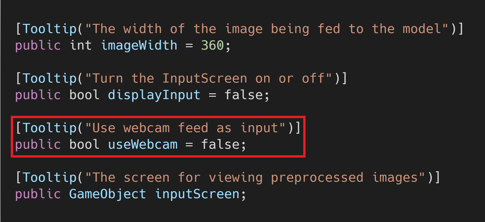
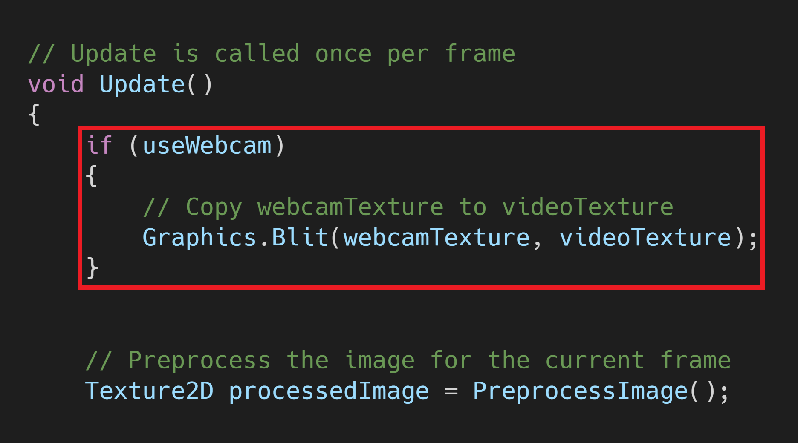
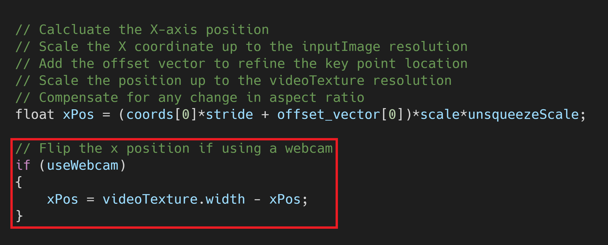
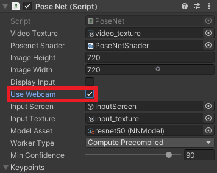

---
aliases:
- /:title/
categories:
- unity
- tutorial
date: '2020-11-15'
description: This post covers how to use a webcam feed as input for the PoseNet model.
hide: false
layout: post
permalink: /:title/
search_exclude: false
title: Barracuda PoseNet Tutorial Pt. 7 (Outdated)
toc: false

---

**Version 2:** [Part 1](https://christianjmills.com/Barracuda-PoseNet-Tutorial-V2-1/) 

**Last Updated:** Dec 1, 2020

### Previous: [Part 6](https://christianjmills.com/Barracuda-PoseNet-Tutorial-6/)

* [Introduction](#introduction)
* [Modify PoseNet Script](#modify-posenet-script)
* [Set Inspector Variable](#set-inspector-variable)
* [Summary](#summary)

## Introduction

It's time to see how our model performs with a webcam. Prerecorded videos are great for testing, but most real-world applications will likely use a live video feed. We'll set up our video feed for a front-facing camera that mirrors the user.

## Modify `PoseNet` Script

We can add the option to use a webcam feed by making some modifications to the `PoseNet` script.

### Create `useWebcam` Variable

Open the `PoseNet` script and create a new public `bool` variable. Name the variable `useWebcam` and set the default value to `false`. This will create a checkbox in the `Inspector` tab that we can use to enable and disable the webcam.

### Create `webcamTexture` Variable

We'll use a [`WebCamTexture`](https://docs.unity3d.com/ScriptReference/WebCamTexture.html) variable to store the live video input from our webcam. Name the variable `webcamTexture`.

### Set Up Webcam Feed

We'll prepare the webcam feed at the top of the `Start()` method. You can find the completed code below.

#### Initialize the `webcamTexture`

First, initialize the `webcamTexture`. We'll use the first video input device Unity finds. If you have more than one webcam attached, you'll need to [specify](https://docs.unity3d.com/ScriptReference/WebCamTexture-ctor.html) the device name.

#### Flip the `VideoScreen`

Next, we need to adjust the rotation and scale of the `VideoScreen` object. The webcam feed doesn't mirror the user by default. For example, the user's right arm appears on the left side of the screen. This can be disorienting when looking at the generated pose skeleton. We'll flip the `VideoScreen` to compensate.

#### Start the Camera

We'll use the `webcamTexture.Play()` method to start the camera.

#### Deactivate the Video Player

Finally, we'll deactivate the `Video Player` as it's not being used. 

#### Completed Code

### Get `webcamTexture` Data

We'll use the `Graphics.Blit()` method to update the `videoTexture` with the data from `webcamTexture`. Add the following code at the top of the `Update()` method. 

### Flip Key Point Locations

Flipping the `VideoScreen` does not flip the `videoTexture` itself. Therefore, the output of the model will not be flipped either. We can fix this by mirroring the `xPos` values for the calculated key point locations.

## Set Inspector Variable

Now we can enable and disable the webcam from the `Inspector` tab.

`Note:` Don't toggle the `useWebcam` parameter during runtime with the code as it is.

## Summary

We can now perform pose estimation using either prerecorded or live video feeds. We'll further increase our flexibility for input sources in the next post by adding the ability to handle input with different aspect ratios.

### [GitHub Repository - Version 1](https://github.com/cj-mills/Barracuda-PoseNet-Tutorial/tree/Version-1)

### Next: [Part 8](https://christianjmills.com/Barracuda-PoseNet-Tutorial-8/)