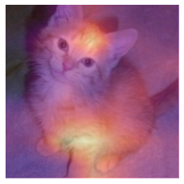
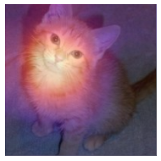

---
categories:
- ai
- fastai
- notes
- pytorch
description: Chapter 18 covers interpreting convolutional neural networks using class-activation
  maps.
hide: false
layout: post
permalink: /:title/
search_exclude: false
title: Notes on fastai Book Ch. 18
toc: false

---

* [CNN Interpretation with CAM](#cnn-interpretation-with-cam)
* [CAM and Hooks](#cam-and-hooks)
* [Gradient CAM](#gradient-cam)
* [References](#references)

-----

```python
#hide
# !pip install -Uqq fastbook
import fastbook
fastbook.setup_book()
```


```python
#hide
from fastbook import *
```


```python
import inspect
def print_source(obj):
    for line in inspect.getsource(obj).split("\n"):
        print(line)
```


## CNN Interpretation with CAM


## CAM and Hooks

### Class Activation Map (CAM)
* [Learning Deep Features for Discriminative Localization](https://arxiv.org/abs/1512.04150)
* uses the output of the last convolutional layer together with the predictions to generate a heatmap visualization of why the model made its decision
* at each position of our final convolutional layer, we have as many filters as in the last linear layer
    * we can compute the dot product of the activations with the final weights to get the score of the feature that was used to make a decision for each location in our feature map
* need a way to get access to the activations inside the model while it is training
    * can use [PyTorch hooks](https://pytorch.org/docs/stable/generated/torch.Tensor.register_hook.html)

### [PyTorch Hooks](https://pytorch.org/docs/stable/generated/torch.Tensor.register_hook.html)
* PyTorch's equivalent of fastai's callbacks
* allow you to inject code into the forward and backward calculations themselves
* can attach a hook to any layer of the model, and it will be executed when we compute the outputs (forward hook) or during backpropogation (backward hook)
* forward hook: 
    * a function that takes a module, its input, and its output
    * can perform any behavior you want

-----


```python
HookCallback
```
```text
    fastai.callback.hook.HookCallback
```

-----

```python
print_source(HookCallback)
```
```text
    @funcs_kwargs
    class HookCallback(Callback):
        "`Callback` that can be used to register hooks on `modules`"
        _methods = ["hook"]
        hook = noops
        def __init__(self, modules=None, every=None, remove_end=True, is_forward=True, detach=True, cpu=True, include_paramless=False , **kwargs):
            store_attr('modules,every,remove_end,is_forward,detach,cpu, include_paramless')
            assert not kwargs
    
        def before_fit(self):
            "Register the `Hooks` on `self.modules`."
            if self.modules is None: self.modules = [m for m in flatten_model(self.model) if self.include_paramless or has_params(m)]
            if self.every is None: self._register()
    
        def before_batch(self):
            if self.every is None: return
            if self.training and self.train_iter%self.every==0: self._register()
    
        def after_batch(self):
            if self.every is None: return
            if self.training and self.train_iter%self.every==0: self._remove()
    
        def after_fit(self):
            "Remove the `Hooks`."
            if self.remove_end: self._remove()
    
        def _register(self): self.hooks = Hooks(self.modules, self.hook, self.is_forward, self.detach, self.cpu)
        def _remove(self):
            if getattr(self, 'hooks', None): self.hooks.remove()
    
        def __del__(self): self._remove()

```

-----


```python
path = untar_data(URLs.PETS)/'images'
path
```
```text
    Path('/home/innom-dt/.fastai/data/oxford-iiit-pet/images')
```

-----

```python
def is_cat(x): return x[0].isupper()
dls = ImageDataLoaders.from_name_func(
    path, get_image_files(path), valid_pct=0.2, seed=21,
    label_func=is_cat, item_tfms=Resize(224))
# Train a cat classifier with the default settings
learn = cnn_learner(dls, resnet34, metrics=error_rate)
learn.fine_tune(1)
```
<div style="overflow-x:auto;">
<table border="1" class="dataframe">
  <thead>
    <tr style="text-align: left;">
      <th>epoch</th>
      <th>train_loss</th>
      <th>valid_loss</th>
      <th>error_rate</th>
      <th>time</th>
    </tr>
  </thead>
  <tbody>
    <tr>
      <td>0</td>
      <td>0.127009</td>
      <td>0.042651</td>
      <td>0.011502</td>
      <td>00:15</td>
    </tr>
  </tbody>
</table>
</div>

<div style="overflow-x:auto;">
<table border="1" class="dataframe">
  <thead>
    <tr style="text-align: left;">
      <th>epoch</th>
      <th>train_loss</th>
      <th>valid_loss</th>
      <th>error_rate</th>
      <th>time</th>
    </tr>
  </thead>
  <tbody>
    <tr>
      <td>0</td>
      <td>0.045776</td>
      <td>0.023368</td>
      <td>0.007442</td>
      <td>00:19</td>
    </tr>
  </tbody>
</table>
</div>
-----

```python
print_source(image_cat)
```
```text
    def image_cat (): return BytesIO(pkgutil.get_data('fastbook', 'images/cat.jpg'))
```

-----

```python
# Load an image of a cat
img = PILImage.create(image_cat())
# Get a batch of data from the test set
x, = first(dls.test_dl([img]))
```

-----


```python
# Define a hook that stores a copy of the output
class Hook():
    def hook_func(self, m, i, o): self.stored = o.detach().clone()
```

-----


```python
# Instantiate a hook
hook_output = Hook()
# Attach the hook to the last layer in the model
hook = learn.model[0].register_forward_hook(hook_output.hook_func)
```

-----


```python
# Perform inference on the test batch
with torch.no_grad(): output = learn.model.eval()(x)
```

-----


```python
# Get the copy of the model activations from the hook
act = hook_output.stored[0]
act.shape
```
```text
    torch.Size([512, 7, 7])
```

-----

```python
# Check the model predictions
F.softmax(output, dim=-1)
```
```text
    TensorBase([[4.0876e-09, 1.0000e+00]], device='cuda:0')
```


**Note:** The model is confident the image contains a cat.


```python
dls.vocab
```
```text
    [False, True]
```

-----

```python
x.shape
```
```text
    torch.Size([1, 3, 224, 224])
```

-----

```python
learn.model[1]
```
```text
    Sequential(
      (0): AdaptiveConcatPool2d(
        (ap): AdaptiveAvgPool2d(output_size=1)
        (mp): AdaptiveMaxPool2d(output_size=1)
      )
      (1): Flatten(full=False)
      (2): BatchNorm1d(1024, eps=1e-05, momentum=0.1, affine=True, track_running_stats=True)
      (3): Dropout(p=0.25, inplace=False)
      (4): Linear(in_features=1024, out_features=512, bias=False)
      (5): ReLU(inplace=True)
      (6): BatchNorm1d(512, eps=1e-05, momentum=0.1, affine=True, track_running_stats=True)
      (7): Dropout(p=0.5, inplace=False)
      (8): Linear(in_features=512, out_features=2, bias=False)
    )
```

-----

```python
learn.model[1][-1]
```
```text
    Linear(in_features=512, out_features=2, bias=False)
```

-----

```python
# Calculate the dot product the weight matrix for the last layer with the activations
cam_map = torch.einsum('ck,kij->cij', learn.model[1][-1].weight, act)
cam_map.shape
```
```text
    torch.Size([2, 7, 7])
```


**Note:** The result of the dot product is a $7x7$ feature map that shows where the activations were higher and lower.


```python
# Get the first image from the test batch
x_dec = TensorImage(dls.train.decode((x,))[0][0])
_,ax = plt.subplots()
x_dec.show(ctx=ax)
# Overlay the feature map for the cat class on top of the cat image
ax.imshow(cam_map[1].detach().cpu(), alpha=0.6, extent=(0,224,224,0),
              interpolation='bilinear', cmap='magma');
```




**Note:** The bright yellow spots correspond to high activations.
* The head and front paw seem to have had the most influence on the model's prediction.

-----


```python
# Remove the hook to avoid memory leaks
hook.remove()
```

-----


```python
print_source(hook.remove)
```
```text
        def remove(self) -> None:
            hooks_dict = self.hooks_dict_ref()
            if hooks_dict is not None and self.id in hooks_dict:
                del hooks_dict[self.id]
```

-----

```python
# Update the custom hook to be a context manager
class Hook():
    def __init__(self, m):
        self.hook = m.register_forward_hook(self.hook_func)   
    def hook_func(self, m, i, o): self.stored = o.detach().clone()
    # Automatically register the hook when entering it
    def __enter__(self, *args): return self
    # Automatically remove the hook when exiting it
    def __exit__(self, *args): self.hook.remove()
```

-----


```python
# Pass the model to the `__enter__()` method for the Hook
with Hook(learn.model[0]) as hook:
    with torch.no_grad(): output = learn.model.eval()(x.cuda())
    act = hook.stored
```

**Note:** This method only works for the last layer.


## Gradient CAM

* [Grad-CAM: Why did you say that?](https://arxiv.org/abs/1611.07450)
    * uses the final activation for the desired class
    * can use Grad-CAM on any layer
    * recall the gradients of the output of the last layers with respect to the input of that layer are equal to the layer weights

-----


```python
# Define a hook that stores a copy of the gradients calculated by PyTorch during the backward pass
class HookBwd():
    def __init__(self, m):
        self.hook = m.register_backward_hook(self.hook_func)   
    def hook_func(self, m, gi, go): self.stored = go[0].detach().clone()
    def __enter__(self, *args): return self
    def __exit__(self, *args): self.hook.remove()
```

-----


```python
# The class index for the cat class
cls = 1
with HookBwd(learn.model[0]) as hookg:
    with Hook(learn.model[0]) as hook:
        output = learn.model.eval()(x.cuda())
        act = hook.stored
    # Get the gradients for the cat class for the first image in the test set
    output[0,cls].backward()
    grad = hookg.stored
```

-----


```python
# Calculate the average of the gradients across the feature map
w = grad[0].mean(dim=[1,2], keepdim=True)
cam_map = (w * act[0]).sum(0)
```

-----


```python
_,ax = plt.subplots()
x_dec.show(ctx=ax)
ax.imshow(cam_map.detach().cpu(), alpha=0.6, extent=(0,224,224,0),
              interpolation='bilinear', cmap='magma');
```


-----

```python
# Get the gradients for the output of the second to last ResNet group
with HookBwd(learn.model[0][-2]) as hookg:
    with Hook(learn.model[0][-2]) as hook:
        output = learn.model.eval()(x.cuda())
        act = hook.stored
    output[0,cls].backward()
    grad = hookg.stored
```

-----


```python
w = grad[0].mean(dim=[1,2], keepdim=True)
cam_map = (w * act[0]).sum(0)
```

-----


```python
_,ax = plt.subplots()
x_dec.show(ctx=ax)
ax.imshow(cam_map.detach().cpu(), alpha=0.6, extent=(0,224,224,0),
              interpolation='bilinear', cmap='magma');
```


-----

```python
print_source(ActivationStats)
```
```text
    @delegates()
    class ActivationStats(HookCallback):
        "Callback that record the mean and std of activations."
        order=-20
        def __init__(self, with_hist=False, **kwargs):
            super().__init__(**kwargs)
            self.with_hist = with_hist
    
        def before_fit(self):
            "Initialize stats."
            super().before_fit()
            self.stats = L()
    
        def hook(self, m, i, o):
            if isinstance(o, tuple): return self.hook_multi_ouput(o)
            o = o.float()
            res = {'mean': o.mean().item(), 'std': o.std().item(),
                   'near_zero': (o<=0.05).long().sum().item()/o.numel()}
            if self.with_hist: res['hist'] = o.histc(40,0,10)
            return res
    
        def hook_multi_ouput(self,o_tuple):
            "For outputs of RNN which are [nested] tuples of tensors"
            res = []
            for o in self._flatten_tuple(o_tuple):
                if not(isinstance(o, Tensor)): continue
                res.append(self.hook(None, None, o))
            return res
    
        def _flatten_tuple(self, o_tuple):
            "Recursively flatten a [nested] tuple"
            res = []
            for it in o_tuple:
                if isinstance(it, tuple): res += self._flatten_tuple(it)
                else: res += [it]
            return tuple(res)
    
        def after_batch(self):
            "Take the stored results and puts it in `self.stats`"
            if self.training and (self.every is None or self.train_iter%self.every == 0):
                self.stats.append(self.hooks.stored)
            super().after_batch()
    
        def layer_stats(self, idx):
            lstats = self.stats.itemgot(idx)
            return L(lstats.itemgot(o) for o in ('mean','std','near_zero'))
    
        def hist(self, idx):
            res = self.stats.itemgot(idx).itemgot('hist')
            return torch.stack(tuple(res)).t().float().log1p()
    
        def color_dim(self, idx, figsize=(10,5), ax=None):
            "The 'colorful dimension' plot"
            res = self.hist(idx)
            if ax is None: ax = subplots(figsize=figsize)[1][0]
            ax.imshow(res, origin='lower')
            ax.axis('off')
    
        def plot_layer_stats(self, idx):
            _,axs = subplots(1, 3, figsize=(12,3))
            for o,ax,title in zip(self.layer_stats(idx),axs,('mean','std','% near zero')):
                ax.plot(o)
                ax.set_title(title)
```


## References

* [Deep Learning for Coders with fastai & PyTorch](https://www.oreilly.com/library/view/deep-learning-for/9781492045519/)
* [The fastai book GitHub Repository](https://github.com/fastai/fastbook)


**Previous:** [Notes on fastai Book Ch. 17](https://christianjmills.com/Notes-on-Fastai-Book-17/)

**Next:** [Notes on fastai Book Ch. 19](https://christianjmills.com/Notes-on-Fastai-Book-19/)