**Version 2:** [Part 1](https://christianjmills.com/Barracuda-PoseNet-Tutorial-V2-1/) 

**Last Updated:** Nov 24, 2020

* [Introduction](#introduction)
* [Prerequisites](#prerequisites)
* [Create a New Project](#create-a-new-project)
* [Import Video Files](#import-video-files)
* [Create the Video Player](#create-the-video-player)
* [Create the Video Screen](#create-the-video-screen)
* [Test the Video Player](#test-the-video-player)
* [Summary](#summary)

## Introduction

This tutorial series provides step-by-step instructions for how to perform human [pose estimation](https://www.fritz.ai/pose-estimation/) in [Unity](https://unity.com/) with the [Barracuda](https://docs.unity3d.com/Packages/com.unity.barracuda@1.0/manual/index.html) inference library. We'll be using a pretrained [PoseNet](https://medium.com/tensorflow/real-time-human-pose-estimation-in-the-browser-with-tensorflow-js-7dd0bc881cd5) model to estimate the 2D locations of key points on an individual's body.

This post demonstrates how to play and view videos inside Unity. We'll later perform pose estimation on individual frames while the video is playing. We can gauge the model's accuracy by comparing the estimated key point locations to the source video.

## Prerequisites

I recommend checking the following prerequisites if you want to follow along on your own computer.

### Unity

This tutorial assumes that you have Unity installed. You can get acquainted with Unity by clicking on one of the tutorials listed below.

### How to Make a Game - Unity Beginner Tutorial

* [Unity 2019.3](https://www.youtube.com/watch?v=OR0e-1UBEOU)
* [Unity 2020.1](https://www.youtube.com/watch?v=Lu76c85LhGY)

**Note:** You can download the exact version of Unity used for this tutorial by clicking the link below. 

* [Unity 2019.4.13](unityhub://2019.4.13f1/518737b1de84)

### Hardware

We'll be performing [inference](https://www.intel.com/content/www/us/en/artificial-intelligence/posts/deep-learning-training-and-inference.html) on the GPU for this series. If possible, use a graphics card from a recent generation.

## Create a New Project

First, we need to create a new Unity project. We'll select the 2D template since the PoseNet model only estimates 2D poses.

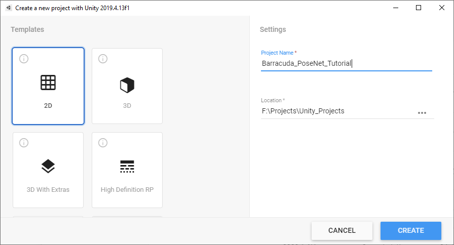

## Import Video Files

We'll be using these two videos available on [Pexels](https://www.pexels.com/), a free stock photos & videos site. The first one is easier for the PoseNet model. The second has some more challenging sections. Download the videos in `Full HD` resolution.

1. [Two Young Men Doing a Boardslide Over a Railing](https://www.pexels.com/video/two-young-men-doing-a-boardslide-over-a-railing-4824358/)

   **Note:** Renamed to `pexels_boardslides`

2. [Woman Dancing](https://www.pexels.com/video/woman-dancing-2873755/)

   **Note:** Renamed to `pexels_woman_dancing`

### Create the Videos Folder

In the `Assets` window, right-click an empty space, select the `Create` option, and click `Folder`. Name the folder `Videos`.

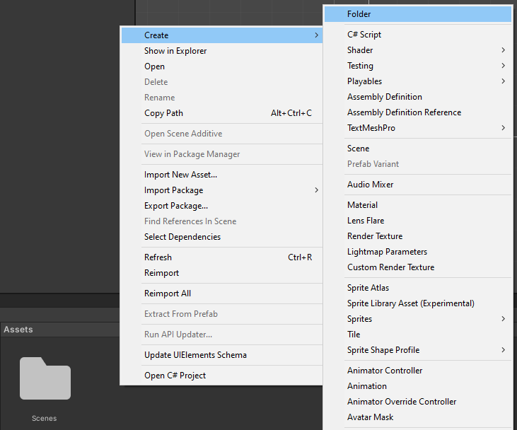

Double-click the `Videos` folder to open it.

### Add Video Files

Drag and drop the two video files from the file explorer into the `Videos` folder.

## Create the Video Player

In the `Hierarchy` tab, right-click an empty area, select the `Video` section, and click `Video Player`. This will create a new `GameObject` called `Video Player`. The default name works well enough so we'll leave it as is.

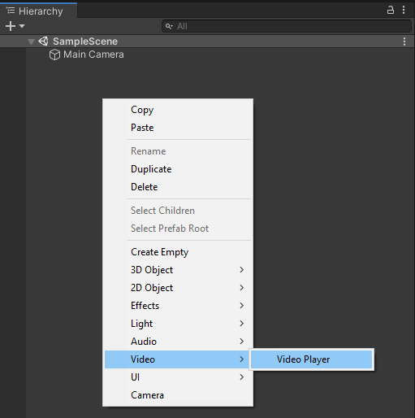

### Set Video Clip

Select the `Video Player` object in the `Hierarchy` tab. Then, drag and drop the `pexels_boardslides` file into the `Video Clip` parameter in the `Inspector` tab.

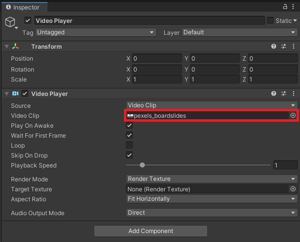

### Make the Video Loop

Tick the `Loop` checkbox in the `Inspector` tab to make the video repeat when the project is running.

## Create the Video Screen

We need to make a "screen" in Unity to watch the video. We'll use a [`Render Texture`](https://docs.unity3d.com/ScriptReference/RenderTexture.html) to store the data for the current frame and attach it to the surface of a `GameObject`. 

### Create a Render Texture

Create a new folder in the `Assets` window and name it `Textures`.

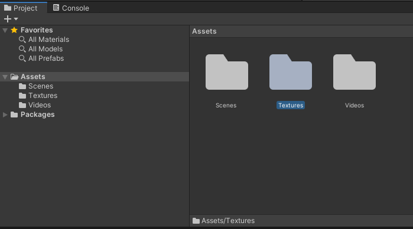

Open the folder and right-click an empty space. Select `Render Texture` in the `Create` submenu and name it `video_texture`.

### Resize the Render Texture

Select the `video_texture` asset and set the `Size` to `1920 x 1080` in the `Inspector` tab. This will match the `video_texture` to the resolution of our videos.

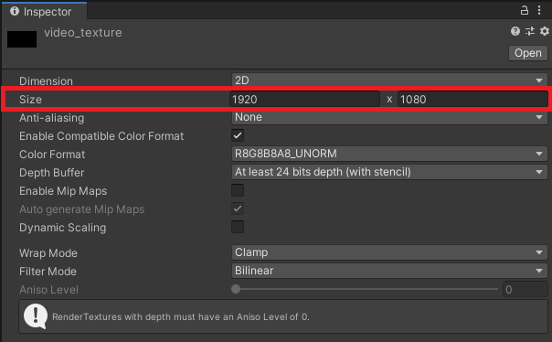

### Assign the Render Texture

With the resolution set, select the `Video Player` object in the `Hierarchy` tab again. Drag and drop the `video_texture` object into the `Target Texture` parameter in the `Inspector` tab.

### Create the Screen GameObject

Now, we need to create the screen itself. We'll use a [`Quad`](https://docs.unity3d.com/Manual/PrimitiveObjects.html) object for the screen. Right click an empty space in the `Hierarchy` tab, select the `3D Object` section and click `Quad`. We can just name it `VideoScreen`.

### Resize the Screen

With the `VideoScreen` object selected, we need to adjust the `Scale` parameter in the `Inspector` tab. Set the `X` value to 1920 and the `Y` value to 1080. Leave the `Z` value at 1.

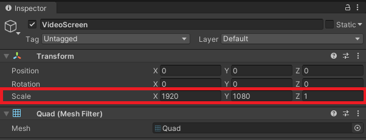

### Set the Screen Position

Next, we'll move `VideoScreen` to make things easier when processing output from the model. We want the bottom left corner to be at the origin. Set the `X` value for `Position` to half the `X` value for the `Scale` parameter. Do the same for the `Y` value. The new `Position` values should be `X: 960 Y: 540 Z: 0`.

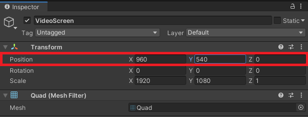

### Reset the Scene Perspective

We should center our perspective on the `VideoScreen`. We can do so by selecting the `VideoScreen` object and pressing the `F` key on our keyboard. You can zoom back in by scrolling up with your mouse wheel.

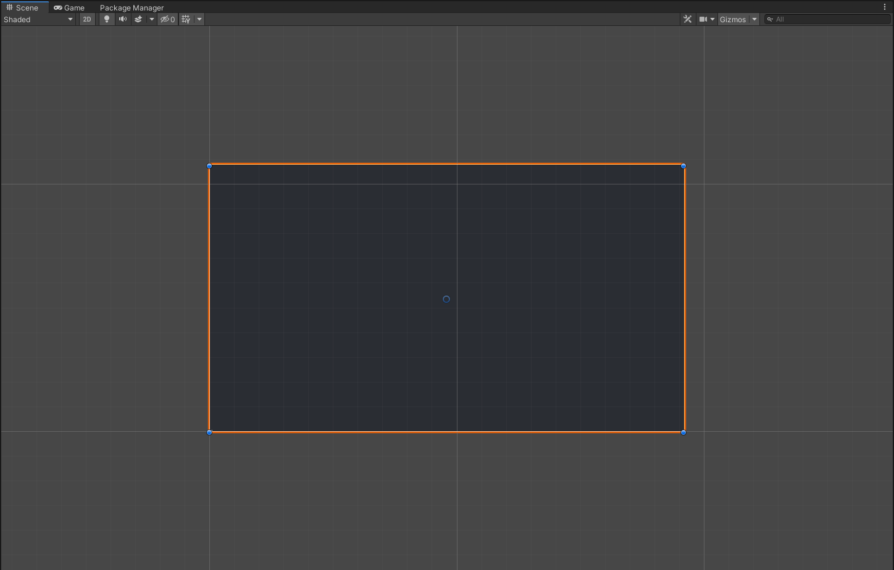

### Apply the Render Texture to the Screen

Drag and drop the `video_texture` asset onto the `VideoScreen` in the `Scene` tab. The `VideoScreen` object should turn completely black.

### Make Video Screen Unlit

With the `VideoScreen` object selected, click the `Shader` dropdown in the `Inspector` tab. Select the Unlit option and click `Texture`. This removes the need for a separate light source. The videos would look extremely dim with the `Standard` shader.

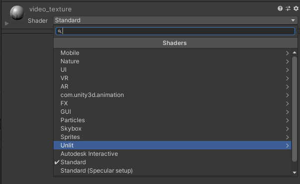

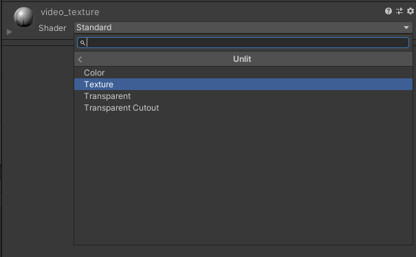

## Camera Setup

Before playing the video, we need to reposition and resize the `Main Camera` object. 

### Set Camera Position

Select the `Main Camera` object in the `Hierarchy` tab and set the `Position` to same `X: 960 Y: 540` as the `VideoScreen` object. Next, we need to set the `Z` value for the `Position` to the opposite of the `X` value.

### Resize the Camera

Finally, we need to adjust the Size parameter to 540 in the `Inspector` tab.

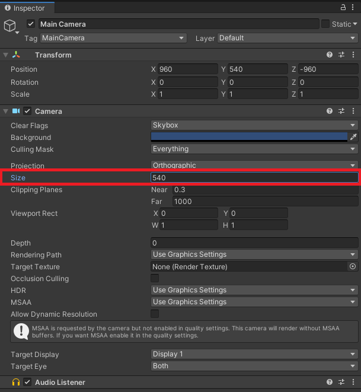

## Test the Video Player

Now we can finally click the play button and watch the video.

### Result

## Summary

We now have a video player that we can use to feed input to the PoseNet model. The next post covers how to prepare input for the model on the GPU.

### [GitHub Repository - Version 1](https://github.com/cj-mills/Barracuda-PoseNet-Tutorial/tree/Version-1)

## Next: [Part 2](https://christianjmills.com/Barracuda-PoseNet-Tutorial-2/)

