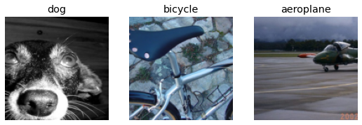
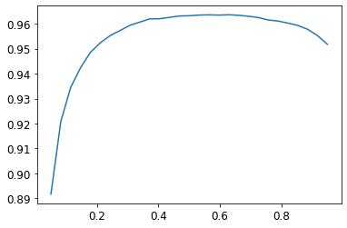
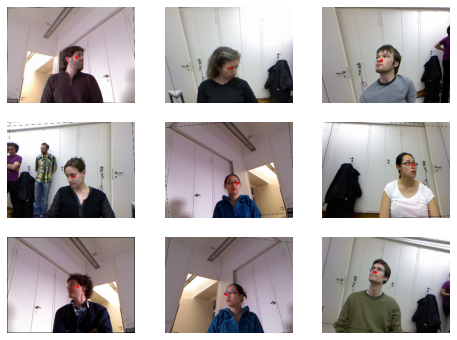
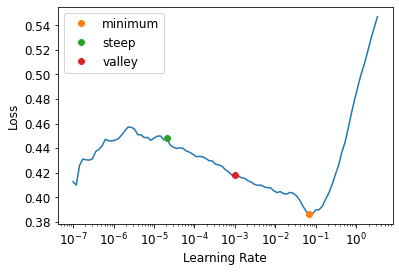

---
categories:
- ai
- fastai
- notes
- pytorch
date: 2022-3-14
description: Chapter 6 covers multi-label classification and image regression.
hide: false
layout: post
search_exclude: false
title: Notes on fastai Book Ch. 6
toc: false

---

* [Multi-Label Classification](#multi-label-classification)
* [Regression](#regression)
* [References](#references)


## Multi-Label Classification

- the problem of identifying the categories of objects in images that may not contain exactly one type of object
    - there may be more than one kind of object or none at all that belong to the target classes
- single-label classifiers cannot properly handle input that either does not contain an object of a target class or contains multiple objects of a different target classes
    - a single-label classifier trained to recognize cats and dogs could not handle an image that contains both cats and dogs
- models deployed in production are more likely to encounter input with zero matches or more than one match

### The Data

```python
from fastai.vision.all import *
```

#### The PASCAL Visual Object Classes Challenge 2007 Dataset

* [http://host.robots.ox.ac.uk/pascal/VOC/voc2007/](http://host.robots.ox.ac.uk/pascal/VOC/voc2007/)
* contains twenty classes
* multiple classes may be present in the same image
* classification labels are stored in a CSV file

-----
```python
path = untar_data(URLs.PASCAL_2007)
path
```
```text
Path('/home/innom-dt/.fastai/data/pascal_2007')
```

-----
```python
path.ls()
```
```v
(#8) [Path('/home/innom-dt/.fastai/data/pascal_2007/segmentation'),Path('/home/innom-dt/.fastai/data/pascal_2007/test'),Path('/home/innom-dt/.fastai/data/pascal_2007/train.csv'),Path('/home/innom-dt/.fastai/data/pascal_2007/valid.json'),Path('/home/innom-dt/.fastai/data/pascal_2007/train'),Path('/home/innom-dt/.fastai/data/pascal_2007/train.json'),Path('/home/innom-dt/.fastai/data/pascal_2007/test.csv'),Path('/home/innom-dt/.fastai/data/pascal_2007/test.json')]
```

-----

```python
df = pd.read_csv(path/'train.csv')
df.head()
```
<div style="overflow-x:auto;">
<table border="1" class="dataframe">
  <thead>
    <tr>
      <th></th>
      <th>fname</th>
      <th>labels</th>
      <th>is_valid</th>
    </tr>
  </thead>
  <tbody>
    <tr>
      <th>0</th>
      <td>000005.jpg</td>
      <td>chair</td>
      <td>True</td>
    </tr>
    <tr>
      <th>1</th>
      <td>000007.jpg</td>
      <td>car</td>
      <td>True</td>
    </tr>
    <tr>
      <th>2</th>
      <td>000009.jpg</td>
      <td>horse person</td>
      <td>True</td>
    </tr>
    <tr>
      <th>3</th>
      <td>000012.jpg</td>
      <td>car</td>
      <td>False</td>
    </tr>
    <tr>
      <th>4</th>
      <td>000016.jpg</td>
      <td>bicycle</td>
      <td>True</td>
    </tr>
  </tbody>
</table>
</div>


Class lables are stored in a space-delimited string


### Pandas and DataFrames

* [https://pandas.pydata.org/docs/index.html](https://pandas.pydata.org/docs/index.html)
* [https://pandas.pydata.org/docs/reference/api/pandas.DataFrame.html](https://pandas.pydata.org/docs/reference/api/pandas.DataFrame.html)

-----


```python
# Access rows and columns using the `iloc` property 
df.iloc[:,0]
```
```text
0       000005.jpg
1       000007.jpg
2       000009.jpg
3       000012.jpg
4       000016.jpg
           ...    
5006    009954.jpg
5007    009955.jpg
5008    009958.jpg
5009    009959.jpg
5010    009961.jpg
Name: fname, Length: 5011, dtype: object
```

-----
```python
df.iloc[0,:]
# Trailing :s are always optional (in numpy, pytorch, pandas, etc.),
#   so this is equivalent:
df.iloc[0]
```
```text
fname       000005.jpg
labels           chair
is_valid          True
Name: 0, dtype: object
```

-----
```python
# Get a column by name
df['fname']
```
```text
0       000005.jpg
1       000007.jpg
2       000009.jpg
3       000012.jpg
4       000016.jpg
           ...    
5006    009954.jpg
5007    009955.jpg
5008    009958.jpg
5009    009959.jpg
5010    009961.jpg
Name: fname, Length: 5011, dtype: object
```

-----

```python
# Initialize a new data frame using a dictionary
tmp_df = pd.DataFrame({'a':[1,2], 'b':[3,4]})
tmp_df
```
<div style="overflow-x:auto;">
<table border="1" class="dataframe">
  <thead>
    <tr>
      <th></th>
      <th>a</th>
      <th>b</th>
    </tr>
  </thead>
  <tbody>
    <tr>
      <th>0</th>
      <td>1</td>
      <td>3</td>
    </tr>
    <tr>
      <th>1</th>
      <td>2</td>
      <td>4</td>
    </tr>
  </tbody>
</table>
</div>


-----

```python
# Perform calculations using columns
tmp_df['c'] = tmp_df['a']+tmp_df['b']
tmp_df
```
<div style="overflow-x:auto;">
<table border="1" class="dataframe">
  <thead>
    <tr>
      <th></th>
      <th>a</th>
      <th>b</th>
      <th>c</th>
    </tr>
  </thead>
  <tbody>
    <tr>
      <th>0</th>
      <td>1</td>
      <td>3</td>
      <td>4</td>
    </tr>
    <tr>
      <th>1</th>
      <td>2</td>
      <td>4</td>
      <td>6</td>
    </tr>
  </tbody>
</table>
</div>


### Constructing a DataBlock

- Dataset: a collection that returns a tuple of your independent and dependent variable for a single item
- DataLoader: An iterator that provides a stream of mini-batches, where each mini-batch is a tuple of a batch of independent variables and a batch of dependent variables
- Datasets: an iterator that contains a training Dataset and a validation Dataset
- DataLoaders: an object that contains a training DataLoader and a validation DataLoader
- By default, a DataBlock assumes we have an input and a target

#### Python Lambda Functions

- great for quickly iterating
- not compatible with serialization
- [How to Use Python Lambda Functions](https://realpython.com/python-lambda/)

One-hot encoding: using a vector of 0s, with a 1 in each location that is represented in the data

-----

```python
# Start with a data block created with no parameters
dblock = DataBlock()
```

-----
```python
# Add a Datasets object using the DataFrame
dsets = dblock.datasets(df)
```

-----
```python
len(dsets.train),len(dsets.valid)
```
```text
(4009, 1002)
```

-----
```python
# Grabs the same thing twice
# Need to specify an input and a target
x,y = dsets.train[0]
x,y
```
```text
(fname       008663.jpg
 labels      car person
 is_valid         False
 Name: 4346, dtype: object,
 fname       008663.jpg
 labels      car person
 is_valid         False
 Name: 4346, dtype: object)
```

-----
```python
x['fname']
```
```text
'008663.jpg'
```

-----
```python
# Tell the DataBlock how to extract the input and target from the DataFrame
# Using lamda functions
dblock = DataBlock(get_x = lambda r: r['fname'], get_y = lambda r: r['labels'])
dsets = dblock.datasets(df)
dsets.train[0]
```
```text
('005620.jpg', 'aeroplane')
```

**Note:** Do not use lambda functions if you need to export the Learner 

-----
```python
# Tell the DataBlock how to extract the input and target from the DataFrame
# Using standard functions
def get_x(r): return r['fname']
def get_y(r): return r['labels']
dblock = DataBlock(get_x = get_x, get_y = get_y)
dsets = dblock.datasets(df)
dsets.train[0]
```
```text
('002549.jpg', 'tvmonitor')
```

**Note:** Need the full file path for the dependent variable and need to split the dependent variables on the space character

-----
```python
def get_x(r): return path/'train'/r['fname']
def get_y(r): return r['labels'].split(' ')
dblock = DataBlock(get_x = get_x, get_y = get_y)
dsets = dblock.datasets(df)
dsets.train[0]
```
```text
(Path('/home/innom-dt/.fastai/data/pascal_2007/train/002844.jpg'), ['train'])
```

#### ImageBlock

* [https://docs.fast.ai/vision.data.html#ImageBlock](https://docs.fast.ai/vision.data.html#ImageBlock)
* A [TransformBlock](https://docs.fast.ai/data.block.html#TransformBlock) for images

#### MultiCategoryBlock

* [https://docs.fast.ai/data.block.html#MultiCategoryBlock](https://docs.fast.ai/data.block.html#MultiCategoryBlock)
* A TransformBlock for multi-label categorical targets
* Uses One-hot encoding
* Expects to receive a list of strings

-----


```python
ImageBlock
```
```text
<function fastai.vision.data.ImageBlock(cls=<class 'fastai.vision.core.PILImage'>)>
```

-----
```python
MultiCategoryBlock
```
```text
<function fastai.data.block.MultiCategoryBlock(encoded=False, vocab=None, add_na=False)>
```

-----

```python
dblock = DataBlock(blocks=(ImageBlock, MultiCategoryBlock),
                   get_x = get_x, get_y = get_y)
dsets = dblock.datasets(df)
dsets.train[0]
```
```text
(PILImage mode=RGB size=500x375,
 TensorMultiCategory([0., 0., 0., 0., 0., 0., 0., 0., 0., 0., 0., 1., 0., 0., 0., 0., 0., 0., 0., 0.]))
```

-----
```python
# Check which object class is represented by the above one-hot encoding
idxs = torch.where(dsets.train[0][1]==1.)[0]
dsets.train.vocab[idxs]
```
```text
(#1) ['dog']
```

-----
```python
# Define a function to split the dataset based on the is_valid column
def splitter(df):
    train = df.index[~df['is_valid']].tolist()
    valid = df.index[df['is_valid']].tolist()
    return train,valid

dblock = DataBlock(blocks=(ImageBlock, MultiCategoryBlock),
                   splitter=splitter,
                   get_x=get_x, 
                   get_y=get_y)

dsets = dblock.datasets(df)
dsets.train[0]
```
```text
(PILImage mode=RGB size=500x333,
 TensorMultiCategory([0., 0., 0., 0., 0., 0., 1., 0., 0., 0., 0., 0., 0., 0., 0., 0., 0., 0., 0., 0.]))
```

-----
```python
dblock = DataBlock(blocks=(ImageBlock, MultiCategoryBlock),
                   splitter=splitter,
                   get_x=get_x, 
                   get_y=get_y,
                   item_tfms = RandomResizedCrop(128, min_scale=0.35))
dls = dblock.dataloaders(df)
```

-----

```python
dls.show_batch(nrows=1, ncols=3)
```


-----
```python
dblock.summary(df)
```
```text
Setting-up type transforms pipelines
Collecting items from            fname          labels  is_valid
0     000005.jpg           chair      True
1     000007.jpg             car      True
2     000009.jpg    horse person      True
3     000012.jpg             car     False
4     000016.jpg         bicycle      True
...          ...             ...       ...
5006  009954.jpg    horse person      True
5007  009955.jpg            boat      True
5008  009958.jpg  person bicycle      True
5009  009959.jpg             car     False
5010  009961.jpg             dog     False

[5011 rows x 3 columns]
Found 5011 items
2 datasets of sizes 2501,2510
Setting up Pipeline: get_x -> PILBase.create
Setting up Pipeline: get_y -> MultiCategorize -- {'vocab': None, 'sort': True, 'add_na': False} -> OneHotEncode -- {'c': None}

Building one sample
  Pipeline: get_x -> PILBase.create
    starting from
      fname       000012.jpg
labels             car
is_valid         False
Name: 3, dtype: object
    applying get_x gives
      /home/innom-dt/.fastai/data/pascal_2007/train/000012.jpg
    applying PILBase.create gives
      PILImage mode=RGB size=500x333
  Pipeline: get_y -> MultiCategorize -- {'vocab': None, 'sort': True, 'add_na': False} -> OneHotEncode -- {'c': None}
    starting from
      fname       000012.jpg
labels             car
is_valid         False
Name: 3, dtype: object
    applying get_y gives
      [car]
    applying MultiCategorize -- {'vocab': None, 'sort': True, 'add_na': False} gives
      TensorMultiCategory([6])
    applying OneHotEncode -- {'c': None} gives
      TensorMultiCategory([0., 0., 0., 0., 0., 0., 1., 0., 0., 0., 0., 0., 0., 0., 0., 0., 0., 0., 0., 0.])

Final sample: (PILImage mode=RGB size=500x333, TensorMultiCategory([0., 0., 0., 0., 0., 0., 1., 0., 0., 0., 0., 0., 0., 0., 0., 0., 0., 0., 0., 0.]))

Collecting items from            fname          labels  is_valid
0     000005.jpg           chair      True
1     000007.jpg             car      True
2     000009.jpg    horse person      True
3     000012.jpg             car     False
4     000016.jpg         bicycle      True
...          ...             ...       ...
5006  009954.jpg    horse person      True
5007  009955.jpg            boat      True
5008  009958.jpg  person bicycle      True
5009  009959.jpg             car     False
5010  009961.jpg             dog     False

[5011 rows x 3 columns]
Found 5011 items
2 datasets of sizes 2501,2510
Setting up Pipeline: get_x -> PILBase.create
Setting up Pipeline: get_y -> MultiCategorize -- {'vocab': None, 'sort': True, 'add_na': False} -> OneHotEncode -- {'c': None}
Setting up after_item: Pipeline: RandomResizedCrop -- {'size': (128, 128), 'min_scale': 0.35, 'ratio': (0.75, 1.3333333333333333), 'resamples': (2, 0), 'val_xtra': 0.14, 'max_scale': 1.0, 'p': 1.0} -> ToTensor
Setting up before_batch: Pipeline: 
Setting up after_batch: Pipeline: IntToFloatTensor -- {'div': 255.0, 'div_mask': 1}

Building one batch
Applying item_tfms to the first sample:
  Pipeline: RandomResizedCrop -- {'size': (128, 128), 'min_scale': 0.35, 'ratio': (0.75, 1.3333333333333333), 'resamples': (2, 0), 'val_xtra': 0.14, 'max_scale': 1.0, 'p': 1.0} -> ToTensor
    starting from
      (PILImage mode=RGB size=500x333, TensorMultiCategory([0., 0., 0., 0., 0., 0., 1., 0., 0., 0., 0., 0., 0., 0., 0., 0., 0., 0., 0., 0.]))
    applying RandomResizedCrop -- {'size': (128, 128), 'min_scale': 0.35, 'ratio': (0.75, 1.3333333333333333), 'resamples': (2, 0), 'val_xtra': 0.14, 'max_scale': 1.0, 'p': 1.0} gives
      (PILImage mode=RGB size=128x128, TensorMultiCategory([0., 0., 0., 0., 0., 0., 1., 0., 0., 0., 0., 0., 0., 0., 0., 0., 0., 0., 0., 0.]))
    applying ToTensor gives
      (TensorImage of size 3x128x128, TensorMultiCategory([0., 0., 0., 0., 0., 0., 1., 0., 0., 0., 0., 0., 0., 0., 0., 0., 0., 0., 0., 0.]))

Adding the next 3 samples

No before_batch transform to apply

Collating items in a batch

Applying batch_tfms to the batch built
  Pipeline: IntToFloatTensor -- {'div': 255.0, 'div_mask': 1}
    starting from
      (TensorImage of size 4x3x128x128, TensorMultiCategory of size 4x20)
    applying IntToFloatTensor -- {'div': 255.0, 'div_mask': 1} gives
      (TensorImage of size 4x3x128x128, TensorMultiCategory of size 4x20)
```


### Binary Cross-Entropy

- Getting Model Activations
    - it is important to know how to manually get a mini-batch, pass it into a model, and look at the activations
- Can’t directly use nll_loss or softmax for a one-hot-encoded dependent variable
    - softmax requires all predictions sum to 1 and tends to push one activation to be much larger than all the other
        - not desirable when there may be multiple objects or none at all in a single image
    - nll_loss returns the value of just one activation
- binary cross-entropy combines mnist_loss with log

-----

```python
learn = cnn_learner(dls, resnet18)
```

#### to_cpu(b)
* [https://docs.fast.ai/torch_core.html#to_cpu](https://docs.fast.ai/torch_core.html#to_cpu)
* Recursively map lists of tensors in `b` to the cpu.

-----
```python
to_cpu
```
```text
<function fastai.torch_core.to_cpu(b)>
```

-----
```python
x,y = to_cpu(dls.train.one_batch())
activs = learn.model(x)
activs.shape
```
```text
torch.Size([64, 20])
```

-----
```python
activs[0]
```
```text
TensorBase([ 0.5674, -1.2013,  4.5409, -1.5284, -0.6600,  0.0999, -2.4757, -0.8773, -0.2934, -1.4746, -0.1738,  2.1763, -3.4473, -1.1407,  0.1783, -1.6922, -2.3396,  0.7602, -1.4213, -0.4334],
       grad_fn=<AliasBackward0>)
```

**Note:** The raw model activations are not scaled between `[0,1]`

-----
```python
def binary_cross_entropy(inputs, targets):
    inputs = inputs.sigmoid()
    return -torch.where(targets==1, inputs, 1-inputs).log().mean()
```

-----
```python
binary_cross_entropy(activs, y)
```
```text
TensorMultiCategory(1.0367, grad_fn=<AliasBackward0>)
```


#### nn.BCELoss
* [https://pytorch.org/docs/stable/generated/torch.nn.BCELoss.html#torch.nn.BCELoss](https://pytorch.org/docs/stable/generated/torch.nn.BCELoss.html#torch.nn.BCELoss)
* measures the binary cross entropy between the predictions and target

#### nn.BCEWithLogitsLoss
* [https://pytorch.org/docs/stable/generated/torch.nn.BCEWithLogitsLoss.html#torch.nn.BCEWithLogitsLoss](https://pytorch.org/docs/stable/generated/torch.nn.BCEWithLogitsLoss.html#torch.nn.BCEWithLogitsLoss)
* combines a sigmoid layer and the BCELoss in a single class

-----
```python
nn.BCEWithLogitsLoss
```
```text
torch.nn.modules.loss.BCEWithLogitsLoss
```

-----
```python
loss_func = nn.BCEWithLogitsLoss()
loss = loss_func(activs, y)
loss
```
```text
TensorMultiCategory(1.0367, grad_fn=<AliasBackward0>)
```


#### Python Partial Functions
* [https://docs.python.org/3/library/functools.html#functools.partial](https://docs.python.org/3/library/functools.html#functools.partial)
* return a new [partial object](https://docs.python.org/3/library/functools.html#partial-objects) that will behave like a function with the positional and keyword arguments
* allows us to bind a function with some arguments or keyword arguments

-----
```python
partial
```
```text
functools.partial
```

-----

```python
def say_hello(name, say_what="Hello"): return f"{say_what} {name}."
say_hello('Jeremy'),say_hello('Jeremy', 'Ahoy!')
```
```text
('Hello Jeremy.', 'Ahoy! Jeremy.')
```

-----
```python
f = partial(say_hello, say_what="Bonjour")
f("Jeremy"),f("Sylvain")
```
```text
('Bonjour Jeremy.', 'Bonjour Sylvain.')
```

#### accuracy_multi
* [https://docs.fast.ai/metrics.html#accuracy_multi](https://docs.fast.ai/metrics.html#accuracy_multi)
* compute accuracy using a threshold value

-----
```python
accuracy_multi
```
```text
<function fastai.metrics.accuracy_multi(inp, targ, thresh=0.5, sigmoid=True)>
```

-----
```python
learn = cnn_learner(dls, resnet50, metrics=partial(accuracy_multi, thresh=0.2))
learn.fine_tune(3, base_lr=3e-3, freeze_epochs=4)
```
<div style="overflow-x:auto;">
<table border="1" class="dataframe">
  <thead>
    <tr style="text-align: left;">
      <th>epoch</th>
      <th>train_loss</th>
      <th>valid_loss</th>
      <th>accuracy_multi</th>
      <th>time</th>
    </tr>
  </thead>
  <tbody>
    <tr>
      <td>0</td>
      <td>0.942860</td>
      <td>0.704590</td>
      <td>0.234223</td>
      <td>00:06</td>
    </tr>
    <tr>
      <td>1</td>
      <td>0.821557</td>
      <td>0.550972</td>
      <td>0.293825</td>
      <td>00:06</td>
    </tr>
    <tr>
      <td>2</td>
      <td>0.604402</td>
      <td>0.202164</td>
      <td>0.813645</td>
      <td>00:06</td>
    </tr>
    <tr>
      <td>3</td>
      <td>0.359336</td>
      <td>0.122809</td>
      <td>0.943466</td>
      <td>00:06</td>
    </tr>
  </tbody>
</table>
<table border="1" class="dataframe">
  <thead>
    <tr style="text-align: left;">
      <th>epoch</th>
      <th>train_loss</th>
      <th>valid_loss</th>
      <th>accuracy_multi</th>
      <th>time</th>
    </tr>
  </thead>
  <tbody>
    <tr>
      <td>0</td>
      <td>0.135016</td>
      <td>0.122502</td>
      <td>0.944601</td>
      <td>00:07</td>
    </tr>
    <tr>
      <td>1</td>
      <td>0.118378</td>
      <td>0.107208</td>
      <td>0.950478</td>
      <td>00:07</td>
    </tr>
    <tr>
      <td>2</td>
      <td>0.098511</td>
      <td>0.103568</td>
      <td>0.951613</td>
      <td>00:07</td>
    </tr>
  </tbody>
</table>
</div>

-----

```python
learn.metrics = partial(accuracy_multi, thresh=0.1)
learn.validate()
```
```text
(#2) [0.10356765240430832,0.9294222593307495]
```

-----
```python
learn.metrics = partial(accuracy_multi, thresh=0.99)
learn.validate()
```
```text
(#2) [0.10356765240430832,0.9427291750907898]
```

-----
```python
preds,targs = learn.get_preds()
```

-----
```python
accuracy_multi(preds, targs, thresh=0.9, sigmoid=False)
```
```text
TensorBase(0.9566)
```

-----

```python
# Try a few different threshold values to see which works best
xs = torch.linspace(0.05,0.95,29)
accs = [accuracy_multi(preds, targs, thresh=i, sigmoid=False) for i in xs]
plt.plot(xs,accs);
```



## Regression

- a model is defined by it independent and dependent variables, along with its loss function
- image regression: the independent variable is an image and the dependent variable is one or more floating point numbers
- key point model:
    - a key point refers to a specific location represented in an image


### Assemble the Data

#### BIWI Kinect Head Pose Database

* [https://icu.ee.ethz.ch/research/datsets.html](https://icu.ee.ethz.ch/research/datsets.html)
* over 15k images of 20 people recorded with a Kinect while turning their heads around freely
* Depth and rgb images are provided for each frame
* ground in the form of the 3D location of the head and its rotation angles
* contains 24 directories numbered from 01 to 24 which correspond to the different people photographed
    * each directory has a corresponding .obj file
    * each directory contains .cal files containing the calibration data for the depth and color cameras
    * each image has a corresponding _pose.txt file containing the location of center of the head in 3D and the head rotation encoded as 3D rotation matrix

-----
```python
path = untar_data(URLs.BIWI_HEAD_POSE)
path
```
```text
Path('/home/innom-dt/.fastai/data/biwi_head_pose')
```

-----
```python
path.ls().sorted()
```
```text
(#50) [Path('/home/innom-dt/.fastai/data/biwi_head_pose/01'),Path('/home/innom-dt/.fastai/data/biwi_head_pose/01.obj'),Path('/home/innom-dt/.fastai/data/biwi_head_pose/02'),Path('/home/innom-dt/.fastai/data/biwi_head_pose/02.obj'),Path('/home/innom-dt/.fastai/data/biwi_head_pose/03'),Path('/home/innom-dt/.fastai/data/biwi_head_pose/03.obj'),Path('/home/innom-dt/.fastai/data/biwi_head_pose/04'),Path('/home/innom-dt/.fastai/data/biwi_head_pose/04.obj'),Path('/home/innom-dt/.fastai/data/biwi_head_pose/05'),Path('/home/innom-dt/.fastai/data/biwi_head_pose/05.obj')...]
```

-----
```python
(path/'01').ls().sorted()
```
```text
(#1000) [Path('/home/innom-dt/.fastai/data/biwi_head_pose/01/depth.cal'),Path('/home/innom-dt/.fastai/data/biwi_head_pose/01/frame_00003_pose.txt'),Path('/home/innom-dt/.fastai/data/biwi_head_pose/01/frame_00003_rgb.jpg'),Path('/home/innom-dt/.fastai/data/biwi_head_pose/01/frame_00004_pose.txt'),Path('/home/innom-dt/.fastai/data/biwi_head_pose/01/frame_00004_rgb.jpg'),Path('/home/innom-dt/.fastai/data/biwi_head_pose/01/frame_00005_pose.txt'),Path('/home/innom-dt/.fastai/data/biwi_head_pose/01/frame_00005_rgb.jpg'),Path('/home/innom-dt/.fastai/data/biwi_head_pose/01/frame_00006_pose.txt'),Path('/home/innom-dt/.fastai/data/biwi_head_pose/01/frame_00006_rgb.jpg'),Path('/home/innom-dt/.fastai/data/biwi_head_pose/01/frame_00007_pose.txt')...]
```


-----
```python
# recursivley get all images in the 24 subdirectories
img_files = get_image_files(path)
# get the file names for the corresponding pose.txt files
def img2pose(x): return Path(f'{str(x)[:-7]}pose.txt')
pose_file = img2pose(img_files[0])
pose_file
```
```text
Path('/home/innom-dt/.fastai/data/biwi_head_pose/22/frame_00304_pose.txt')
```

-----
```python
!cat $pose_file
```
```text
0.999485 -0.00797222 -0.031067 
-0.00416483 0.928156 -0.372168 
0.031802 0.372106 0.927645 

62.3638 96.2159 979.839 
```

-----
```python
im = PILImage.create(img_files[0])
im.shape
```
```text
(480, 640)
```

-----
```python
im.to_thumb(160)
```


#### np.genfromtxt

* [https://numpy.org/doc/stable/reference/generated/numpy.genfromtxt.html](https://numpy.org/doc/stable/reference/generated/numpy.genfromtxt.html)
* Load data from a text file

-----
```python
np.genfromtxt
```
```text
<function numpy.genfromtxt(fname, dtype=<class 'float'>, comments='#', delimiter=None, skip_header=0, skip_footer=0, converters=None, missing_values=None, filling_values=None, usecols=None, names=None, excludelist=None, deletechars=" !#$%&'()*+,-./:;<=>?@[\\]^{|}~", replace_space='_', autostrip=False, case_sensitive=True, defaultfmt='f%i', unpack=None, usemask=False, loose=True, invalid_raise=True, max_rows=None, encoding='bytes', *, like=None)>
```

-----
```python
# Contains the calibration values for this folder's rgb camera
# Skip the last six lines in the file 
cal = np.genfromtxt(path/'01'/'rgb.cal', skip_footer=6)
cal
```
```text
array([[517.679,   0.   , 320.   ],
       [  0.   , 517.679, 240.5  ],
       [  0.   ,   0.   ,   1.   ]])
```

-----
```python
# Extract the 2D coordinates for the center of a head
# Serves as the get_y function for a DataBlock
def get_ctr(f):
    # Skip the last 3 lines in the file
    ctr = np.genfromtxt(img2pose(f), skip_header=3)
    c1 = ctr[0] * cal[0][0]/ctr[2] + cal[0][2]
    c2 = ctr[1] * cal[1][1]/ctr[2] + cal[1][2]
    return tensor([c1,c2])
```

-----
```python
np.genfromtxt(img2pose(img_files[0]), skip_header=3)
```
```text
array([ 62.3638,  96.2159, 979.839 ])
```

-----
```python
get_ctr(img_files[0])
```
```text
tensor([352.9487, 291.3338])
```

#### PointBlock

* Documentation: [https://docs.fast.ai/vision.data.html#PointBlock](https://docs.fast.ai/vision.data.html#PointBlock)
* Source Code: [https://github.com/fastai/fastai/blob/d84b426e2afe17b3af09b33f49c77bd692625f0d/fastai/vision/data.py#L74](https://github.com/fastai/fastai/blob/d84b426e2afe17b3af09b33f49c77bd692625f0d/fastai/vision/data.py#L74)
* A TransfromBlock for points in an image
* Lets fastai know to perform the same data augmentation steps to the key point values as to the images

-----
```python
PointBlock
```
```text
<fastai.data.block.TransformBlock at 0x7fb65aaf5490>
```

-----

```python
# Construct custom DataBlock
biwi = DataBlock(
    blocks=(ImageBlock, PointBlock),
    get_items=get_image_files,
    get_y=get_ctr,
    # Have the validation set contain images for a single person
    splitter=FuncSplitter(lambda o: o.parent.name=='13'),
    batch_tfms=[*aug_transforms(size=(240,320)), 
                Normalize.from_stats(*imagenet_stats)]
)
```

-----
```python
dls = biwi.dataloaders(path)
dls.show_batch(max_n=9, figsize=(8,6))
```


-----
```python
xb,yb = dls.one_batch()
xb.shape,yb.shape
```
```text
(torch.Size([64, 3, 240, 320]), torch.Size([64, 1, 2]))
```

-----

```python
yb[0]
```
```text
TensorPoint([[-0.1246,  0.0960]], device='cuda:0')
```

### Training a Model

```python
# Set range of coordinate values for the model output to [-1,1]
learn = cnn_learner(dls, resnet18, y_range=(-1,1))
```

-----
```python
def sigmoid_range(x, lo, hi): return torch.sigmoid(x) * (hi-lo) + lo
```

-----
```python
plot_function(partial(sigmoid_range,lo=-1,hi=1), min=-4, max=4)
```


-----
```python
dls.loss_func
```
```text
FlattenedLoss of MSELoss()
```

-----
```python
min_lr, steep_lr, valley = learn.lr_find(suggest_funcs=(minimum, steep, valley))
```


-----
```python
min_lr
```
```text
0.006918309628963471
```

-----
```python
steep_lr
```
```text
2.0892961401841603e-05
```

-----
```python
valley
```
```text
0.0010000000474974513
```

-----
```python
lr = 1e-2
learn.fine_tune(3, lr)
```
<div style="overflow-x:auto;">
<table border="1" class="dataframe">
  <thead>
    <tr style="text-align: left;">
      <th>epoch</th>
      <th>train_loss</th>
      <th>valid_loss</th>
      <th>time</th>
    </tr>
  </thead>
  <tbody>
    <tr>
      <td>0</td>
      <td>0.048689</td>
      <td>0.026659</td>
      <td>00:36</td>
    </tr>
  </tbody>
</table>
<table border="1" class="dataframe">
  <thead>
    <tr style="text-align: left;">
      <th>epoch</th>
      <th>train_loss</th>
      <th>valid_loss</th>
      <th>time</th>
    </tr>
  </thead>
  <tbody>
    <tr>
      <td>0</td>
      <td>0.007270</td>
      <td>0.002140</td>
      <td>00:47</td>
    </tr>
    <tr>
      <td>1</td>
      <td>0.002966</td>
      <td>0.000160</td>
      <td>00:47</td>
    </tr>
    <tr>
      <td>2</td>
      <td>0.001556</td>
      <td>0.000042</td>
      <td>00:47</td>
    </tr>
  </tbody>
</table>
</div>


-----
```python
# Calculate the Root Mean Squared Error
math.sqrt(0.000042)
```
```text
0.00648074069840786
```

-----

```python
learn.show_results(ds_idx=1, nrows=3, figsize=(6,8))
```


## References

* [Deep Learning for Coders with fastai & PyTorch](https://www.oreilly.com/library/view/deep-learning-for/9781492045519/)
* [The fastai book GitHub Repository](https://github.com/fastai/fastbook)


**Previous:** [Notes on fastai Book Ch. 5](https://christianjmills.com/Notes-on-Fastai-Book-05/)

**Next:** [Notes on fastai Book Ch. 7](https://christianjmills.com/Notes-on-Fastai-Book-07/)

