* [Overview](#overview)
* [Set Up Unity Hub](#set-up-unity-hub)
* [Install Unity Editor](#install-unity-editor)
* [Create New Project](#create-new-project)
* [Install Barracuda Package](#install-barracuda-package)
* [Import Assets](#import-assets)
* [Create Image Classifier Script](#create-image-classifier-script)
* [Create Processing Shaders](#create-processing-shaders)
* [Set up Unity Scene](#set-up-unity-scene)
* [Test in Editor](#test-in-editor)
* [Summary](#summary)


## Overview

[Part 1](../part-1) covered training an image classification model using the fastai library and exporting it to ONNX. In this post, we'll cover implementing a trained image classification model in a Unity project using the Barracuda library.


## Set Up Unity Hub

Before creating a project, we need to install [Unity Hub](https://unity3d.com/get-unity/download), create a [UnityID account](https://id.unity.com/), and activate a (free) Unity license. The beginner Unity tutorial linked below covers all these steps and how to create a simple flappy bird-style game. 

* [Make Your First Video Game - Ultimate Beginner Unity3D Tutorial](https://www.youtube.com/watch?v=8rdfcq-jePw&t=113s)

The link opens to the part covering how to install Unity for the first time, but I recommend watching the entire tutorial for those new to Unity.


## Install Unity Editor

Once we have Unity Hub installed and an activated license, we need to install a version of the Unity Editor. We will use the latest 2022.1+ release as early versions have some issues building WebGL projects with Barracuda. The tutorial uses 2022.1.3.f1, which you can install directly from the link below.

* **Unity download archive:** [Unity 2022.1.3](unityhub://2022.1.3f1/1cedbfe38737)

Open Unity Hub and select the `Installs` section in the side panel. Then click the `Install Editor` button in the upper right-hand corner.

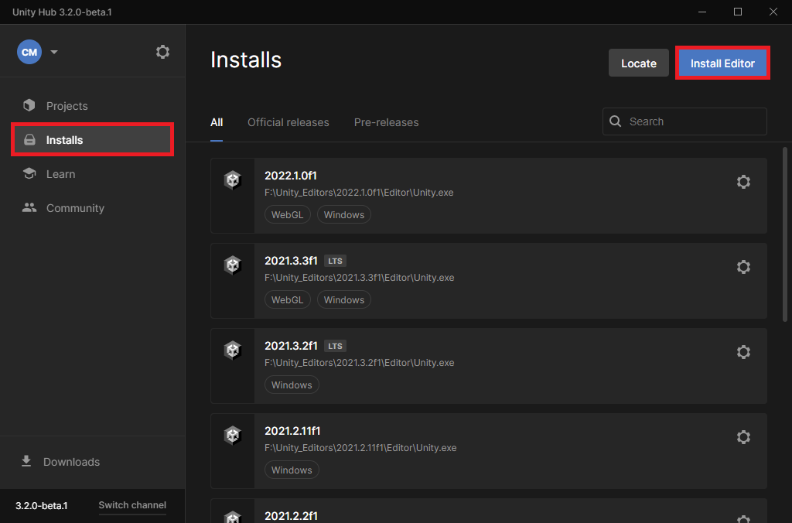


Click the `Install` button next to the latest `2022.1` version under `Other Versions`.


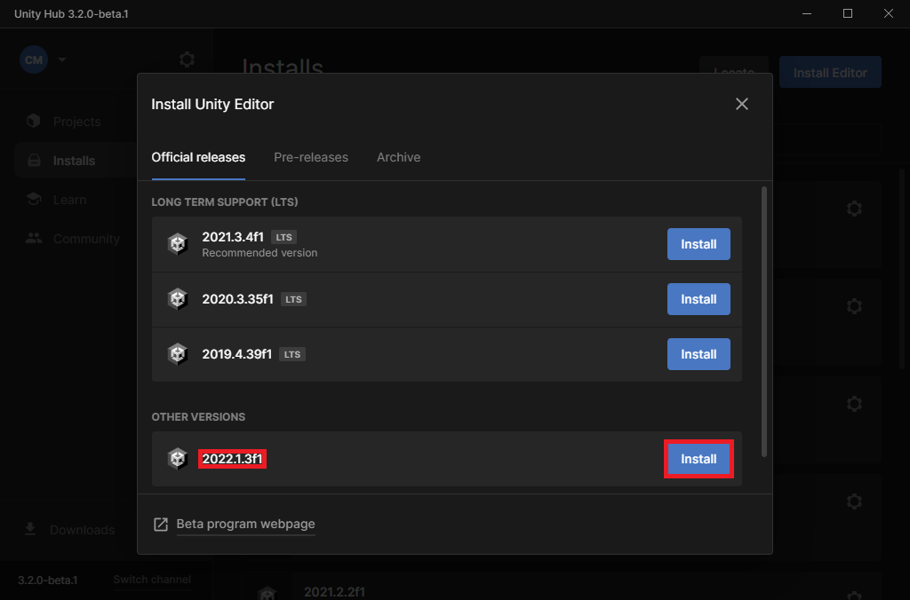


Scroll down the `Add modules` selection menu and click the check box next to `WebGL Build Support`. Feel free to add any additional target platforms here as well. Click the `Install` button after selecting all desired modules.


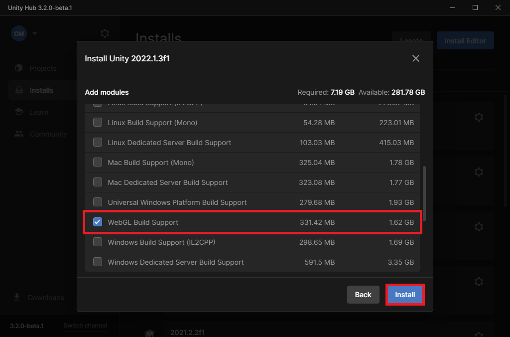


Unity Hub will begin downloading and installing the selected editor version. If the install fails the first time, click the retry button, and it should complete successfully.


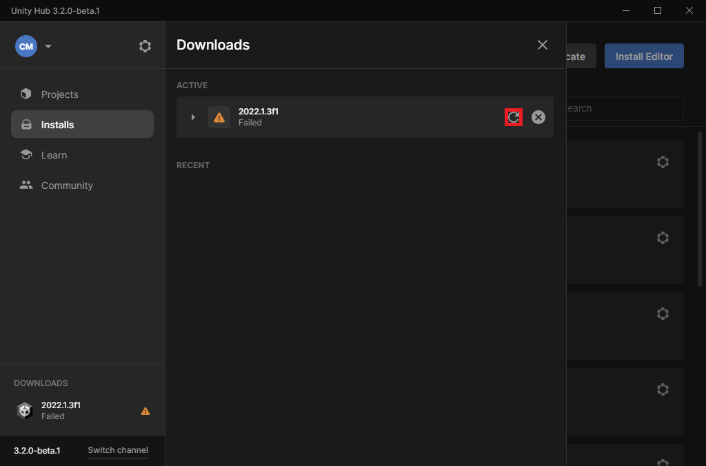


## Create New Project

Go back to the Projects section after the editor finishes installing and click New Project.

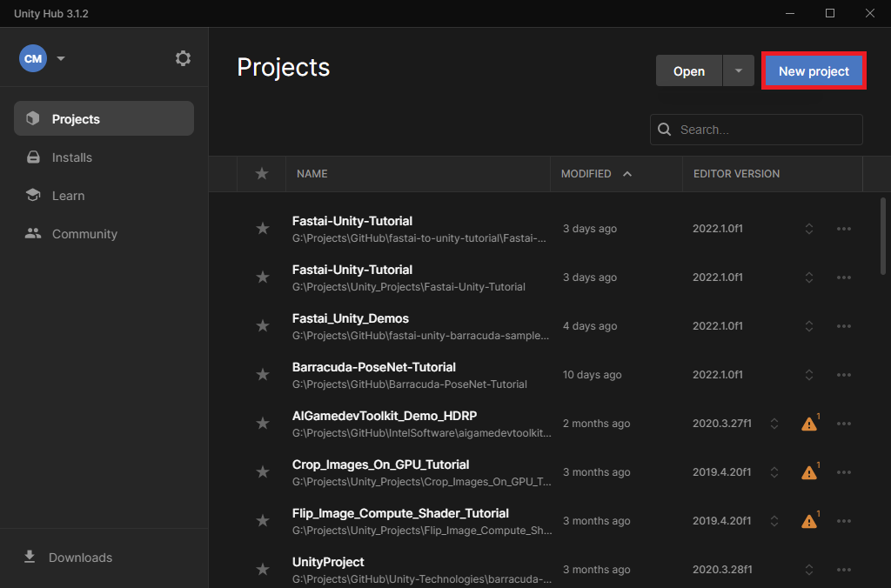


Select the target editor version from the Editor Version dropdown menu.


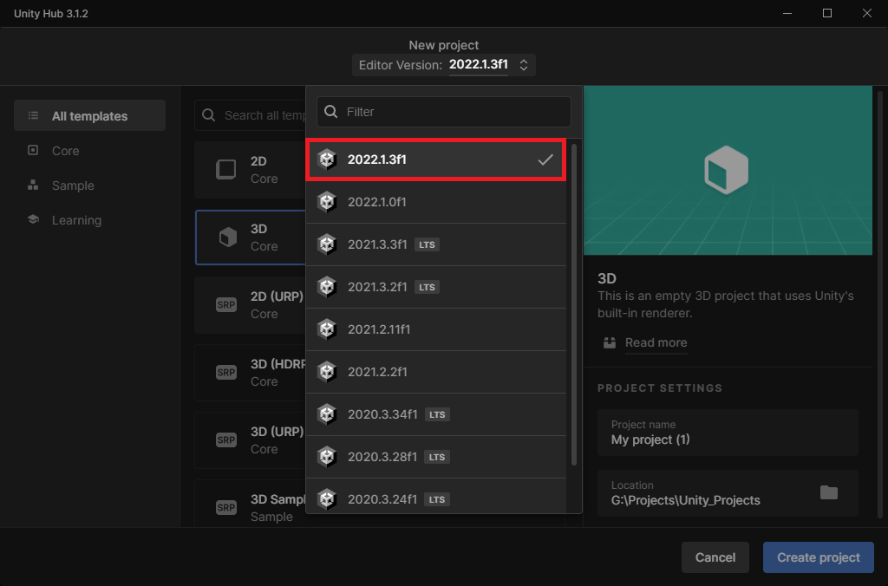


Select the 2D Core template.


Pick a name for the project and a location for the project folder.


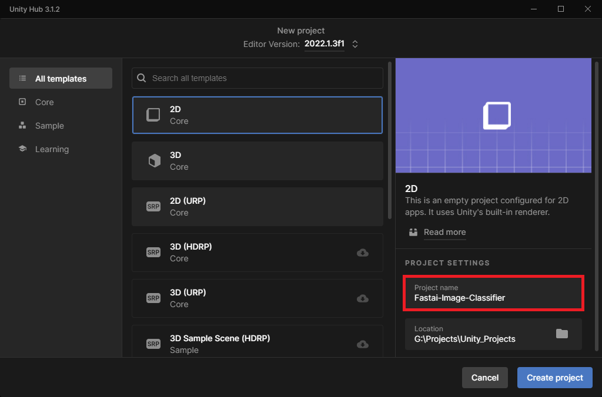


Finally, click Create Project in the lower right-hand corner.


## Install Barracuda Package

Inside the editor window, we'll first install the Barracuda package. Select `Window → Package Manager` from the top menu.

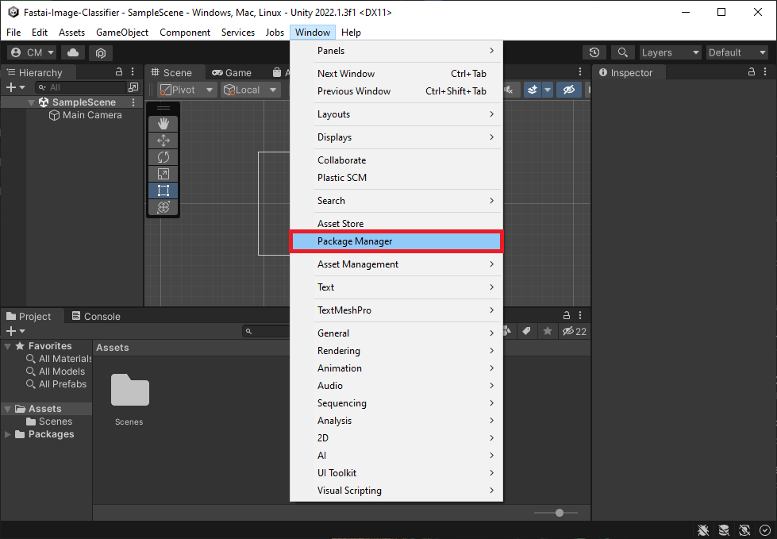


In the Package Manager window, click the little `+` sign in the upper left-hand corner and select `Add package from git URL...` from the dropdown menu.


Enter `com.unity.barracuda` into the text box and click `Add`.


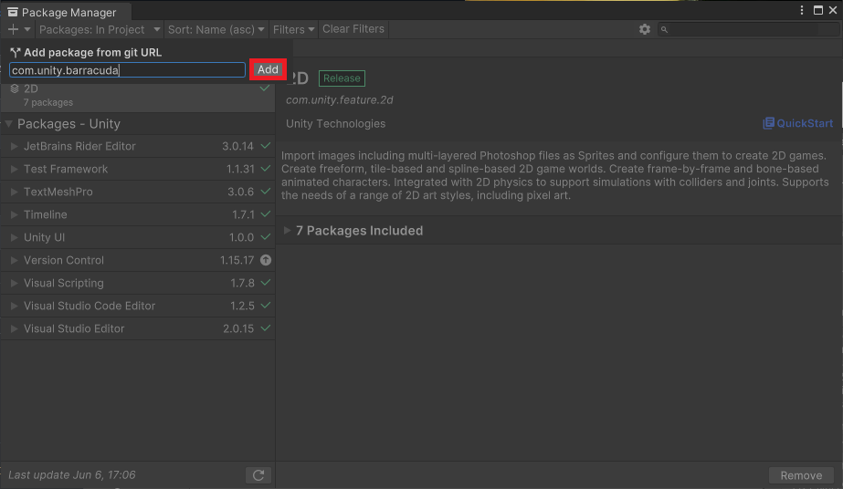


Wait for the Barracuda package to install and close the Package Manager window.


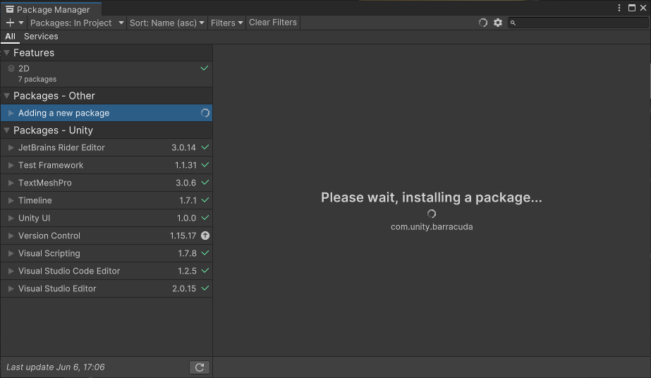


## Import Assets

Next, we'll import any ONNX, JSON, and test image files into the Assets folder. Right-click a space in the Assets section and select `Create → Folder` from the popup menu.


Name the new folder Models.


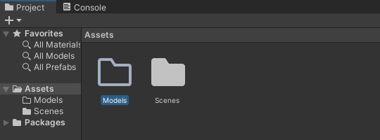


Drag and drop any ONNX files and JSON class label files from the operating system's file explorer into the Models folder. Sample files are available in the Google Drive link below.

* **Google Drive:** [Model Asssets](https://drive.google.com/drive/folders/1VCDqvkBiHOJX5Xe64Ay3Y2ARz4ZBmqCw?usp=sharing)


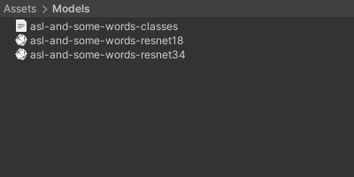


We can click on an ONNX file to examine it in the Inspector tab on the right-hand side of the editor window.


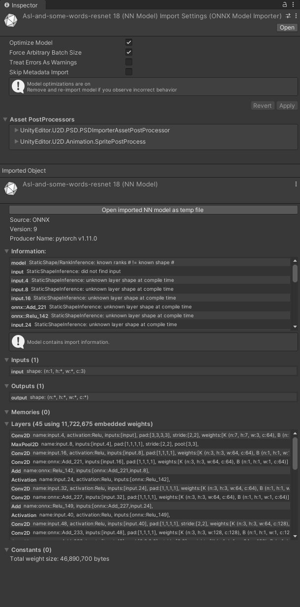


When [Netron](https://netron.app/) is available, we can double-click on the ONNX file to open it in Netron.


<div style="overflow-y:auto; max-height:500px">
    
</div>


Next, create an Images folder and drop any test images into it. 


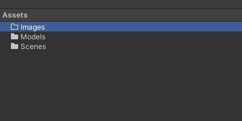

Maybe stick with symmetrical hand signs (e.g., Play) since the model expects mirrored input images.

**Google Drive:** [Image Assets](https://drive.google.com/drive/folders/1MyMQZzLx_PoCl3vArCjMqRWQkVyf99Cz?usp=sharing)

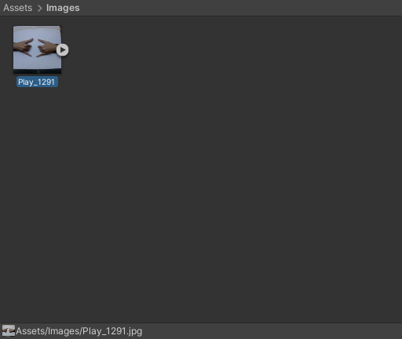


Unity automatically imports images as a Sprite (2D and UI) [texture type](https://docs.unity3d.com/Manual/TextureTypes.html). We don't need to change it for our purposes.


## Create Image Classifier Script

Now we can start coding. We'll store C# scripts in a new Scripts folder. Right-click a space inside it and select `Create → C# Script`. 


We'll name the script `ImageClassifier`.


**Default script code**

By default, C# scripts contain the following code.

```c#
using System.Collections;
using System.Collections.Generic;
using UnityEngine;

public class ImageClassifier : MonoBehaviour
{
    // Start is called before the first frame update
    void Start()
    {
        
    }

    // Update is called once per frame
    void Update()
    {
        
    }
}
```


**Add required namespaces**

* [Unity.Barracuda](https://docs.unity3d.com/Packages/com.unity.barracuda@3.0/api/Unity.Barracuda.html): Provides access to the Barracuda API.
* [System](https://docs.microsoft.com/en-us/dotnet/api/system?view=net-5.0): Contains fundamental classes and base classes that define commonly-used value and reference data types, events and event handlers, interfaces, attributes, and processing exceptions.
* [UnityEngine.UI](https://docs.unity3d.com/Packages/com.unity.ugui@1.0/api/UnityEngine.UI.html): Provides access to UI elements.
* [UnityEngine.Rendering](https://docs.unity3d.com/Packages/com.unity.render-pipelines.core@5.9/api/UnityEngine.Rendering.html): Provides access to the elements of the rendering pipeline.

------

```c#
using System.Collections;
using System.Collections.Generic;
using UnityEngine;
using Unity.Barracuda;
using UnityEngine.Rendering;
using System;
using UnityEngine.UI;
```


### Define public variables

We'll add the required public variables above the Start method. We will be able to access these variables in the Inspector tab. We can add [Header](https://docs.unity3d.com/ScriptReference/HeaderAttribute.html) attributes to organize the public variables in the Inspector tab and use [Tooltip](https://docs.unity3d.com/ScriptReference/TooltipAttribute.html) attributes to provide information about variables.


**Define scene object variables**

First, we need a variable to access the screen object that displays either a test image or webcam input.

```c#
[Header("Scene Objects")]
[Tooltip("The Screen object for the scene")]
public Transform screen;
```


**Define data processing variables**

Next, we'll define the variables for processing model input. We can set the default target input resolution to 216 and use it to scale the source resolution while maintaining the original aspect ratio.

The only preprocessing step we need to implement is normalizing images using the ImageNet stats. The fastest way to do this is with shaders. Shaders are programs that run on the GPU. We will implement ImageNet normalization in a [Compute Shader](https://docs.unity3d.com/Manual/class-ComputeShader.html) and a [Fragment shader](https://docs.unity3d.com/Manual/SL-VertexFragmentShaderExamples.html) to account for platform support. We attach a Fragment shader to a [Material](https://docs.unity3d.com/Manual/Materials.html), so that is what we'll pass into the script.

```c#
[Header("Data Processing")]
[Tooltip("The target minimum model input dimensions")]
public int targetDim = 216;
[Tooltip("The compute shader for GPU processing")]
public ComputeShader processingShader;
[Tooltip("The material with the fragment shader for GPU processing")]
public Material processingMaterial;
```


**Define Barracuda variables**

We'll add the required private variables right below the public variables. We pass in ONNX files as an [NNModel](https://docs.unity3d.com/Packages/com.unity.barracuda@3.0/api/Unity.Barracuda.NNModel.html) object. 

We'll be adding a SoftMax and an Argmax layer to the end of the model, so we need to define names for those. We need to indicate the output layer we want to modify with the new layers. In our case, there is only one output layer. 

By default, Barracuda uses a channels-last order for Tensors. However, switching to channels first can significantly improve performance on some GPUs.

We can choose from [several](https://docs.unity3d.com/Packages/com.unity.barracuda@3.0/api/Unity.Barracuda.WorkerFactory.Type.html) different inference backends (Although we'll only want to use two in practice). The Auto option will automatically pick the best backend for the target platform.

```c#
[Header("Barracuda")]
[Tooltip("The Barracuda/ONNX asset file")]
public NNModel modelAsset;
[Tooltip("The name for the custom softmax output layer")]
public string softmaxLayer = "softmaxLayer";
[Tooltip("The name for the custom softmax output layer")]
public string argmaxLayer = "argmaxLayer";
[Tooltip("The target output layer index")]
public int outputLayerIndex = 0;
[Tooltip("EXPERIMENTAL: Indicate whether to order tensor data channels first")]
public bool useNCHW = true;
[Tooltip("The model execution backend")]
public WorkerFactory.Type workerType = WorkerFactory.Type.Auto;
```


**Define output processing variables**

As mentioned in a [previous post](../../deep-learning-unity-intro/), reading model output from the GPU to the CPU can cause a significant performance bottleneck. Therefore, we will add the option to read the model output asynchronously at the cost of a few frames of latency. Unfortunately, this feature does not work with the inference backend used for WebGL builds.

We pass in the JSON file containing the class labels as a [TextAsset](https://docs.unity3d.com/ScriptReference/TextAsset.html).

```c#
[Header("Output Processing")]
[Tooltip("Asynchronously download model output from the GPU to the CPU.")]
public bool useAsyncGPUReadback = true;
[Tooltip("A json file containing the class labels")]
public TextAsset classLabels;
```


**Define variables for debugging**

Next, we'll add a Boolean variable to toggle printing debug messages to the console. These messages get printed to the console in the browser as well.

```c#
[Header("Debugging")]
[Tooltip("Print debugging messages to the console")]
public bool printDebugMessages = true;
```


**Define webcam variables**

We need to specify a desired resolution and framerate when using a webcam as input.

```c#
[Header("Webcam")]
[Tooltip("Use a webcam as input")]
public bool useWebcam = false;
[Tooltip("The requested webcam dimensions")]
public Vector2Int webcamDims = new Vector2Int(1280, 720);
[Tooltip("The requested webcam framerate")]
[Range(0, 60)]
public int webcamFPS = 60;
```


**Define variables for user interface**

We'll make a simple GUI that displays the predicted class, the current framerate, and controls for selecting webcam devices.

```c#
[Header("GUI")]
[Tooltip("Display predicted class")]
public bool displayPredictedClass = true;
[Tooltip("Display fps")]
public bool displayFPS = true;
[Tooltip("The on-screen text color")]
public Color textColor = Color.red;
[Tooltip("The scale value for the on-screen font size")]
[Range(0, 99)]
public int fontScale = 50;
[Tooltip("The number of seconds to wait between refreshing the fps value")]
[Range(0.01f, 1.0f)]
public float fpsRefreshRate = 0.1f;
[Tooltip("The toggle for using a webcam as the input source")]
public Toggle useWebcamToggle;
[Tooltip("The dropdown menu that lists available webcam devices")]
public Dropdown webcamDropdown;
```


### Define private variables

We'll add the required private variables right below the public variables.


**Define private webcam  variables**

We'll keep a list of available webcam devices so users can switch between them. Unity renders webcam input to a [WebcamTexture](https://docs.unity3d.com/ScriptReference/WebCamTexture.html).

```c#
// List of available webcam devices
private WebCamDevice[] webcamDevices;
// Live video input from a webcam
private WebCamTexture webcamTexture;
// The name of the current webcam  device
private string currentWebcam;
```


**Define input variables**

We'll update the dimensions and content of the screen object based on the test image or webcam.

```c#
// The test image dimensions
private Vector2Int imageDims;
// The test image texture
private Texture imageTexture;
// The current screen object dimensions
private Vector2Int screenDims;
// The model input texture
private RenderTexture inputTexture;
```


**Define Barracuda variables**

We execute models in Barracuda using an [IWorker ](https://docs.unity3d.com/Packages/com.unity.barracuda@3.0/api/Unity.Barracuda.IWorker.html)interface  and store data in [Tensor](https://docs.unity3d.com/Packages/com.unity.barracuda@3.0/api/Unity.Barracuda.Tensor.html) objects.

```c#
// The main interface to execute models
private IWorker engine;
// Stores the input data for the model
private Tensor input;
```


**Define variables for handling asynchronous GPU readback**

When using asynchronous GPU readback, we need one Texture that stores data on the GPU and one that stores data on the CPU.

```c#
// Stores the raw model output on the GPU when using useAsyncGPUReadback
private RenderTexture outputTextureGPU;
// Stores the raw model output on the CPU when using useAsyncGPUReadback
private Texture2D outputTextureCPU;
```


**Define variables for tracking class labels**

We need to create a little class that indicates the structure of the JSON content. Our JSON file only contains a single array of strings. We can store this array in a dedicated variable.

```c#
// A class for reading in class labels from a JSON file
class ClassLabels { public string[] classes; }
// The ordered list of class names
private string[] classes;
// Stores the predicted class index
private int classIndex;
```


**Define variables for tracking the framerate**

Lastly, we need to define a couple of variables for the custom fps counter.

```c#
// The current frame rate value
private int fps = 0;
// Controls when the frame rate value updates
private float fpsTimer = 0f;
```


### Define Initialization Methods

We first need to define some methods to initialize webcams, the screen object, any GUI dropdown menus, and the in-game camera.


**Define method to initialize a webcam device**


```c#
/// <summary>
/// Initialize the selected webcam device
/// </summary>
/// <param name="deviceName">The name of the selected webcam device</param>
private void InitializeWebcam(string deviceName)
{
    // Stop any webcams already playing
    if (webcamTexture && webcamTexture.isPlaying) webcamTexture.Stop();

    // Create a new WebCamTexture
    webcamTexture = new WebCamTexture(deviceName, webcamDims.x, webcamDims.y, webcamFPS);

    // Start the webcam
    webcamTexture.Play();
    // Check if webcam is playing
    useWebcam = webcamTexture.isPlaying;
    // Update toggle value
    useWebcamToggle.SetIsOnWithoutNotify(useWebcam);

    Debug.Log(useWebcam ? "Webcam is playing" : "Webcam not playing, option disabled");
}
```


**Define method to initialize the in-scene screen object**


```c#
/// <summary>
/// Resize and position an in-scene screen object
/// </summary>
private void InitializeScreen()
{
    // Set the texture for the screen object
    screen.gameObject.GetComponent<MeshRenderer>().material.mainTexture = useWebcam ? webcamTexture : imageTexture;
    // Set the screen dimensions
    screenDims = useWebcam ? new Vector2Int(webcamTexture.width, webcamTexture.height) : imageDims;

    // Flip the screen around the Y-Axis when using webcam
    float yRotation = useWebcam ? 180f : 0f;
    // Invert the scale value for the Z-Axis when using webcam
    float zScale = useWebcam ? -1f : 1f;

    // Set screen rotation
    screen.rotation = Quaternion.Euler(0, yRotation, 0);
    // Adjust the screen dimensions
    screen.localScale = new Vector3(screenDims.x, screenDims.y, zScale);

    // Adjust the screen position
    screen.position = new Vector3(screenDims.x / 2, screenDims.y / 2, 1);
}
```


**Define method to initialize GUI dropdown menu options**


```c#
/// <summary>
/// Initialize the GUI dropdown list
/// </summary>
private void InitializeDropdown()
{
    // Create list of webcam device names
    List<string> webcamNames = new List<string>();
    foreach (WebCamDevice device in webcamDevices) webcamNames.Add(device.name);

    // Remove default dropdown options
    webcamDropdown.ClearOptions();
    // Add webcam device names to dropdown menu
    webcamDropdown.AddOptions(webcamNames);
    // Set the value for the dropdown to the current webcam device
    webcamDropdown.SetValueWithoutNotify(webcamNames.IndexOf(currentWebcam));
}
```


**Define method to initialize the in-scene camera object**


```c#
/// <summary>
/// Resize and position the main camera based on an in-scene screen object
/// </summary>
/// <param name="screenDims">The dimensions of an in-scene screen object</param>
private void InitializeCamera(Vector2Int screenDims, string cameraName = "Main Camera")
{
    // Get a reference to the Main Camera GameObject
    GameObject camera = GameObject.Find(cameraName);
    // Adjust the camera position to account for updates to the screenDims
    camera.transform.position = new Vector3(screenDims.x / 2, screenDims.y / 2, -10f);
    // Render objects with no perspective (i.e. 2D)
    camera.GetComponent<Camera>().orthographic = true;
    // Adjust the camera size to account for updates to the screenDims
    camera.GetComponent<Camera>().orthographicSize = screenDims.y / 2;
}
```


**Define method to initialize a Barracuda inference interface**


```c#
/// <summary>
/// Initialize an interface to execute the specified model using the specified backend
/// </summary>
/// <param name="model">The target model representation</param>
/// <param name="workerType">The target compute backend</param>
/// <param name="useNCHW">EXPERIMENTAL: The channel order for the compute backend</param>
/// <returns></returns>
private IWorker InitializeWorker(Model model, WorkerFactory.Type workerType, bool useNCHW = true)
{
    // Validate the selected worker type
    workerType = WorkerFactory.ValidateType(workerType);

    // Set the channel order of the compute backend to channel-first
    if (useNCHW) ComputeInfo.channelsOrder = ComputeInfo.ChannelsOrder.NCHW;

    // Create a worker to execute the model using the selected backend
    return WorkerFactory.CreateWorker(workerType, model);
}
```


### Define Start method

The [Start](https://docs.unity3d.com/ScriptReference/MonoBehaviour.Start.html) method is [called](https://docs.unity3d.com/Manual/ExecutionOrder.html) once before the first frame update, so we'll perform any required setup steps here.

```c#
// Start is called before the first frame update
void Start()
{
    // Get the source image texture
    imageTexture = screen.gameObject.GetComponent<MeshRenderer>().material.mainTexture;
    // Get the source image dimensions as a Vector2Int
    imageDims = new Vector2Int(imageTexture.width, imageTexture.height);

    // Initialize list of available webcam devices
    webcamDevices = WebCamTexture.devices;
    foreach (WebCamDevice device in webcamDevices) Debug.Log(device.name);
    currentWebcam = webcamDevices[0].name;
    useWebcam = webcamDevices.Length > 0 ? useWebcam : false;
    // Initialize webcam
    if (useWebcam) InitializeWebcam(currentWebcam);

    // Resize and position the screen object using the source image dimensions
    InitializeScreen();
    // Resize and position the main camera using the source image dimensions
    InitializeCamera(screenDims);

    // Get an object oriented representation of the model
    Model m_RunTimeModel = ModelLoader.Load(modelAsset);
    // Get the name of the target output layer
    string outputLayer = m_RunTimeModel.outputs[outputLayerIndex];

    // Create a model builder to modify the m_RunTimeModel
    ModelBuilder modelBuilder = new ModelBuilder(m_RunTimeModel);

    // Add a new Softmax layer
    modelBuilder.Softmax(softmaxLayer, outputLayer);
    // Add a new Argmax layer
    modelBuilder.Reduce(Layer.Type.ArgMax, argmaxLayer, softmaxLayer);
    // Initialize the interface for executing the model
    engine = InitializeWorker(modelBuilder.model, workerType, useNCHW);

    // Initialize the GPU output texture
    outputTextureGPU = RenderTexture.GetTemporary(1, 1, 24, RenderTextureFormat.ARGBHalf);
    // Initialize the CPU output texture
    outputTextureCPU = new Texture2D(1, 1, TextureFormat.RGBAHalf, false);

    // Initialize list of class labels from JSON file
    classes = JsonUtility.FromJson<ClassLabels>(classLabels.text).classes;

    // Initialize the webcam dropdown list
    InitializeDropdown();
}
```


### Define Processing Methods

Next, we need to define methods to process images using the Compute Shader, calculate the input resolution, handle asynchronous GPU readback, and process raw model output.


**Define method to process images using a compute shader**


```c#
/// <summary>
/// Process the provided image using the specified function on the GPU
/// </summary>
/// <param name="image">The target image RenderTexture</param>
/// <param name="computeShader">The target ComputerShader</param>
/// <param name="functionName">The target ComputeShader function</param>
/// <returns></returns>
private void ProcessImageGPU(RenderTexture image, ComputeShader computeShader, string functionName)
{
    // Specify the number of threads on the GPU
    int numthreads = 8;
    // Get the index for the specified function in the ComputeShader
    int kernelHandle = computeShader.FindKernel(functionName);
    // Define a temporary HDR RenderTexture
    RenderTexture result = RenderTexture.GetTemporary(image.width, image.height, 24, RenderTextureFormat.ARGBHalf);
    // Enable random write access
    result.enableRandomWrite = true;
    // Create the HDR RenderTexture
    result.Create();

    // Set the value for the Result variable in the ComputeShader
    computeShader.SetTexture(kernelHandle, "Result", result);
    // Set the value for the InputImage variable in the ComputeShader
    computeShader.SetTexture(kernelHandle, "InputImage", image);

    // Execute the ComputeShader
    computeShader.Dispatch(kernelHandle, result.width / numthreads, result.height / numthreads, 1);

    // Copy the result into the source RenderTexture
    Graphics.Blit(result, image);

    // Release the temporary RenderTexture
    RenderTexture.ReleaseTemporary(result);
}
```


**Define method to calculate input resolution**


```c#
/// <summary>
/// Scale the source image resolution to the target input dimensions
/// while maintaing the source aspect ratio.
/// </summary>
/// <param name="imageDims"></param>
/// <param name="targetDims"></param>
/// <returns></returns>
private Vector2Int CalculateInputDims(Vector2Int imageDims, int targetDim)
{
    // Clamp the minimum dimension value to 64px
    targetDim = Mathf.Max(targetDim, 64);

    Vector2Int inputDims = new Vector2Int();

    // Calculate the input dimensions using the target minimum dimension
    if (imageDims.x >= imageDims.y)
    {
        inputDims[0] = (int)(imageDims.x / ((float)imageDims.y / (float)targetDim));
        inputDims[1] = targetDim;
    }
    else
    {
        inputDims[0] = targetDim;
        inputDims[1] = (int)(imageDims.y / ((float)imageDims.x / (float)targetDim));
    }

    return inputDims;
}
```


**Define method to handle asynchronous GPU readback**


```c#
/// <summary>
/// Called once AsyncGPUReadback has been completed
/// </summary>
/// <param name="request"></param>
private void OnCompleteReadback(AsyncGPUReadbackRequest request)
{
    if (request.hasError)
    {
        Debug.Log("GPU readback error detected.");
        return;
    }

    // Make sure the Texture2D is not null
    if (outputTextureCPU)
    {
        // Fill Texture2D with raw data from the AsyncGPUReadbackRequest
        outputTextureCPU.LoadRawTextureData(request.GetData<uint>());
        // Apply changes to Textur2D
        outputTextureCPU.Apply();
    }
}
```


**Define method to process raw model output**


```c#
/// <summary>
/// Process the raw model output to get the predicted class index
/// </summary>
/// <param name="engine">The interface for executing the model</param>
/// <returns></returns>
private int ProcessOutput(IWorker engine)
{
    int classIndex = -1;

    // Get raw model output
    Tensor output = engine.PeekOutput(argmaxLayer);

    if (useAsyncGPUReadback)
    {
        // Copy model output to a RenderTexture
        output.ToRenderTexture(outputTextureGPU);
        // Asynchronously download model output from the GPU to the CPU
        AsyncGPUReadback.Request(outputTextureGPU, 0, TextureFormat.RGBAHalf, OnCompleteReadback);
        // Get the predicted class index
        classIndex = (int)outputTextureCPU.GetPixel(0, 0).r;

        // Check if index is valid
        if (classIndex < 0 || classIndex >= classes.Length) Debug.Log("Output texture not initialized");
    }
    else
    {
        // Get the predicted class index
        classIndex = (int)output[0];
    }

    if (printDebugMessages) Debug.Log($"Class Index: {classIndex}");

    // Dispose Tensor and associated memories.
    output.Dispose();

    return classIndex;
}
```


### Define Update method

We'll place anything we want to run every frame in the [Update](https://docs.unity3d.com/ScriptReference/MonoBehaviour.Update.html) method.

```c#
// Update is called once per frame
void Update()
{
    useWebcam = webcamDevices.Length > 0 ? useWebcam : false;
    if (useWebcam)
    {
        // Initialize webcam if it is not already playing
        if (!webcamTexture || !webcamTexture.isPlaying) InitializeWebcam(currentWebcam);

        // Skip the rest of the method if the webcam is not initialized
        if (webcamTexture.width <= 16) return;

        // Make sure screen dimensions match webcam resolution when using webcam
        if (screenDims.x != webcamTexture.width)
        {
            // Resize and position the screen object using the source image dimensions
            InitializeScreen();
            // Resize and position the main camera using the source image dimensions
            InitializeCamera(screenDims);
        }
    }
    else if (webcamTexture && webcamTexture.isPlaying)
    {
        // Stop the current webcam
        webcamTexture.Stop();

        // Resize and position the screen object using the source image dimensions
        InitializeScreen();
        // Resize and position the main camera using the source image dimensions
        InitializeCamera(screenDims);
    }

    // Scale the source image resolution
    Vector2Int inputDims = CalculateInputDims(screenDims, targetDim);
    if (printDebugMessages) Debug.Log($"Input Dims: {inputDims.x} x {inputDims.y}");

    // Initialize the input texture with the calculated input dimensions
    inputTexture = RenderTexture.GetTemporary(inputDims.x, inputDims.y, 24, RenderTextureFormat.ARGBHalf);
    if (printDebugMessages) Debug.Log($"Input Dims: {inputTexture.width}x{inputTexture.height}");

    // Copy the source texture into model input texture
    Graphics.Blit((useWebcam ? webcamTexture : imageTexture), inputTexture);

    // Disable asynchronous GPU readback when not using a Compute Shader backend
    useAsyncGPUReadback = engine.Summary().Contains("Unity.Barracuda.ComputeVarsWithSharedModel") ? useAsyncGPUReadback : false;

    if (SystemInfo.supportsComputeShaders)
    {
        // Normalize the input pixel data
        ProcessImageGPU(inputTexture, processingShader, "NormalizeImageNet");

        // Initialize a Tensor using the inputTexture
        input = new Tensor(inputTexture, channels: 3);
    }
    else
    {
        // Define a temporary HDR RenderTexture
        RenderTexture result = RenderTexture.GetTemporary(inputTexture.width,
                                                          inputTexture.height, 24, RenderTextureFormat.ARGBHalf);
        RenderTexture.active = result;

        // Apply preprocessing steps
        Graphics.Blit(inputTexture, result, processingMaterial);

        // Initialize a Tensor using the inputTexture
        input = new Tensor(result, channels: 3);
        RenderTexture.ReleaseTemporary(result);
    }

    // Execute the model with the input Tensor
    engine.Execute(input);
    // Dispose Tensor and associated memories.
    input.Dispose();

    // Release the input texture
    RenderTexture.ReleaseTemporary(inputTexture);
    // Get the predicted class index
    classIndex = ProcessOutput(engine);
    // Check if index is valid
    bool validIndex = classIndex >= 0 && classIndex < classes.Length;
    if (printDebugMessages) Debug.Log(validIndex ? $"Predicted Class: {classes[classIndex]}" : "Invalid index");

    // Unload assets when running in a web browser
    if (Application.platform == RuntimePlatform.WebGLPlayer) Resources.UnloadUnusedAssets();
}
```


### Define GUI Methods

We need some methods to handle user interactions with the GUI and display the predicted class and current framerate.


**Define method to update webcam usage from GUI**


```c#
/// <summary>
/// This method is called when the value for the webcam toggle changes
/// </summary>
/// <param name="useWebcam"></param>
public void UpdateWebcamToggle(bool useWebcam)
{
    this.useWebcam = useWebcam;
}
```


**Define method to update webcam device from GUI**


```c#
/// <summary>
/// The method is called when the selected value for the webcam dropdown changes
/// </summary>
public void UpdateWebcamDevice()
{
    currentWebcam = webcamDevices[webcamDropdown.value].name;
    Debug.Log($"Selected Webcam: {currentWebcam}");
    // Initialize webcam if it is not already playing
    if (useWebcam) InitializeWebcam(currentWebcam);

    // Resize and position the screen object using the source image dimensions
    InitializeScreen();
    // Resize and position the main camera using the source image dimensions
    InitializeCamera(screenDims);
}
```


**Define OnGUI method**

We'll display the predicted class and current frame rate in the [OnGUI](https://docs.unity3d.com/ScriptReference/MonoBehaviour.OnGUI.html) method.

```c#
// OnGUI is called for rendering and handling GUI events.
public void OnGUI()
{
    // Define styling information for GUI elements
    GUIStyle style = new GUIStyle
    {
        fontSize = (int)(Screen.width * (1f / (100f - fontScale)))
    };
    style.normal.textColor = textColor;

    // Define screen spaces for GUI elements
    Rect slot1 = new Rect(10, 10, 500, 500);
    Rect slot2 = new Rect(10, style.fontSize * 1.5f, 500, 500);

    // Verify predicted class index is valid
    bool validIndex = classIndex >= 0 && classIndex < classes.Length;
    string content = $"Predicted Class: {(validIndex ? classes[classIndex] : "Invalid index")}";
    if (displayPredictedClass) GUI.Label(slot1, new GUIContent(content), style);

    // Update framerate value
    if (Time.unscaledTime > fpsTimer)
    {
        fps = (int)(1f / Time.unscaledDeltaTime);
        fpsTimer = Time.unscaledTime + fpsRefreshRate;
    }

    // Adjust screen position when not showing predicted class
    Rect fpsRect = displayPredictedClass ? slot2 : slot1;
    if (displayFPS) GUI.Label(fpsRect, new GUIContent($"FPS: {fps}"), style);
}
```


### Define OnDisable Method

We'll perform any clean-up steps in the [OnDisable ](https://docs.unity3d.com/ScriptReference/MonoBehaviour.OnDisable.html)method.

```c#
// OnDisable is called when the MonoBehavior becomes disabled
private void OnDisable()
{
    // Release the resources allocated for the outputTextureGPU
    RenderTexture.ReleaseTemporary(outputTextureGPU);

    // Release the resources allocated for the inference engine
    engine.Dispose();
}
```


## Create Processing Shaders

Now we need to create the Shaders for normalizing input images. We'll store the shaders in a new Shaders folder.


### Create Compute Shader

Right-click a space in the Shaders folder and select `Create → Shader → Compute Shader`.


Name the Compute Shader `ProcessingShader` and open it in the code editor.


**Default Compute Shader Code**

```c#
// Each #kernel tells which function to compile; you can have many kernels
#pragma kernel CSMain

// Create a RenderTexture with enableRandomWrite flag and set it
// with cs.SetTexture
RWTexture2D<float4> Result;

[numthreads(8,8,1)]
void CSMain (uint3 id : SV_DispatchThreadID)
{
    // TODO: insert actual code here!

    Result[id.xy] = float4(id.x & id.y, (id.x & 15)/15.0, (id.y & 15)/15.0, 0.0);
}
```


We need to add a new Texture2D variable to store the pixel data for the input image. We'll remove the default method and create a new one called `NormalizeImageNet`. We need to replace the default method name in the #pragma kernel line at the top.


```c#
// Each #kernel tells which function to compile; you can have many kernels
#pragma kernel NormalizeImageNet

// The pixel data for the input image
Texture2D<float4> InputImage;
// The pixel data for the processed image
RWTexture2D<float4> Result;

// Apply the ImageNet normalization stats from PyTorch to an image
[numthreads(8, 8, 1)]
void NormalizeImageNet(uint3 id : SV_DispatchThreadID)
{
    // Set the pixel color values for the processed image
    Result[id.xy] = float4(
        // Normalize the red color channel values
        (InputImage[id.xy].r - 0.4850f) / 0.2290f,
        // Normalize the green color channel values
        (InputImage[id.xy].g - 0.4560f) / 0.2240f,
        // Normalize the blue color channel values
        (InputImage[id.xy].b - 0.4060f) / 0.2250f,
        // Ignore the alpha/transparency channel
        InputImage[id.xy].a);
}
```


### Create Image Effect Shader

Right-click a space in the Shaders folder and select `Create → Shader → Image Effect Shader`.


Name the new shader `NormalizeImageNet` and open it in the code editor.


**Default Image Effect Shader Code**

```c#
Shader "Hidden/NormalizeImageNet"
{
    Properties
    {
        _MainTex ("Texture", 2D) = "white" {}
    }
    SubShader
    {
        // No culling or depth
        Cull Off ZWrite Off ZTest Always

        Pass
        {
            CGPROGRAM
            #pragma vertex vert
            #pragma fragment frag

            #include "UnityCG.cginc"

            struct appdata
            {
                float4 vertex : POSITION;
                float2 uv : TEXCOORD0;
            };

            struct v2f
            {
                float2 uv : TEXCOORD0;
                float4 vertex : SV_POSITION;
            };

            v2f vert (appdata v)
            {
                v2f o;
                o.vertex = UnityObjectToClipPos(v.vertex);
                o.uv = v.uv;
                return o;
            }

            sampler2D _MainTex;

            fixed4 frag (v2f i) : SV_Target
            {
                fixed4 col = tex2D(_MainTex, i.uv);
                // just invert the colors
                col.rgb = 1 - col.rgb;
                return col;
            }
            ENDCG
        }
    }
}
```


The string at the top of the file indicates the path to access the shader in the Unity Editor. We can replace the Hidden folder name with Processing Shaders to keep things more organized. We'll replace the fixed4 frag method with the normalization steps.


```c#
Shader "Processing Shaders/NormalizeImageNet"
{
    Properties
    {
        _MainTex("Texture", 2D) = "white" {}
    }
    SubShader
    {
        // No culling or depth
        Cull Off ZWrite Off ZTest Always

        Pass
        {
            CGPROGRAM
            #pragma vertex vert
            #pragma fragment frag

            #include "UnityCG.cginc"

            struct appdata
            {
                float4 vertex : POSITION;
                float2 uv : TEXCOORD0;
            };

            struct v2f
            {
                float2 uv : TEXCOORD0;
                float4 vertex : SV_POSITION;
            };

            v2f vert(appdata v)
            {
                v2f o;
                o.vertex = UnityObjectToClipPos(v.vertex);
                o.uv = v.uv;
                return o;
            }

            sampler2D _MainTex;

            // Set the pixel color values for the processed image
            float4 frag(v2f i) : SV_Target
            {
                float4 col = tex2D(_MainTex, i.uv);
                // Normalize the red color channel values
                col.r = (col.r - 0.4850) / 0.2290;
                // Normalize the green color channel values
                col.g = (col.g - 0.4560) / 0.2240;
                // Normalize the blue color channel values
                col.b = (col.b - 0.4060) / 0.2250;
                return col;
            }
            ENDCG
        }
    }
}

```


**Create Normalize ImageNet Material**

Next, we need to create a new material to use the NormalizeImageNet shader. Right-click a space in the Shaders folder and select Create → Material.

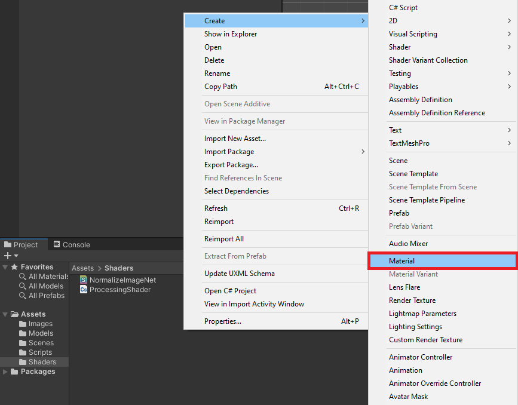


We can name it `NormalizeImageNet` as well.


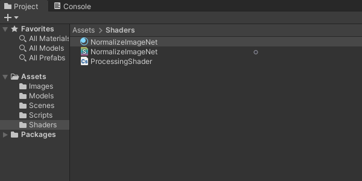


With the new Material selected, open the Shader dropdown menu at the top of the Inspector tab. Type in the Material's name and press enter.


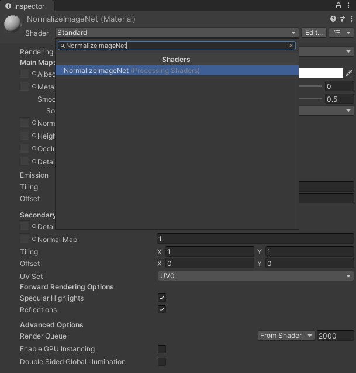


## Set up Unity Scene

We can, at last, start setting up our Unity scene. We need a screen to display the webcam feed, an empty object to attach the `ImageClassifier` script, a dropdown menu for selecting webcam devices, and a toggle to switch between the test image and a webcam feed.


**Create Screen object**

Right-click a space in the Hierarchy tab and select 3D Object → Quad. We can name the new object Screen.


Next, drag and drop a test image from the Assets → Images folder onto the Screen object in the Scene view. Note that the Screen looks a bit dim. We need to change the shader for the Screen's Material so that it does not require an external light source.


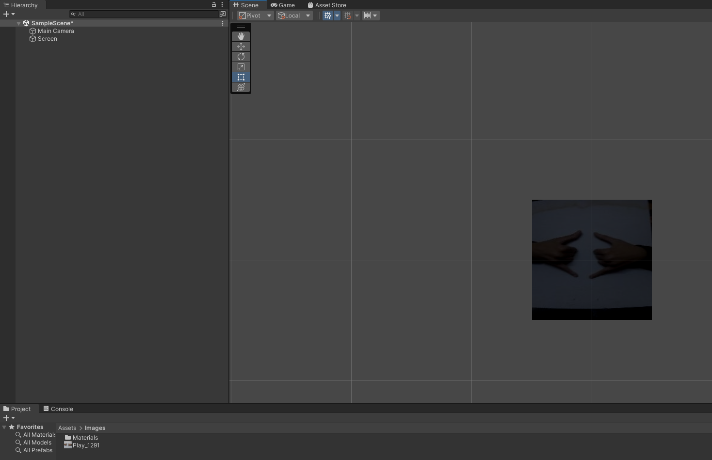


Select the Screen in the Hierarchy tab and open the Shader dropdown menu in the Inspector tab. Type Unlit/Texture into the search box and press enter.


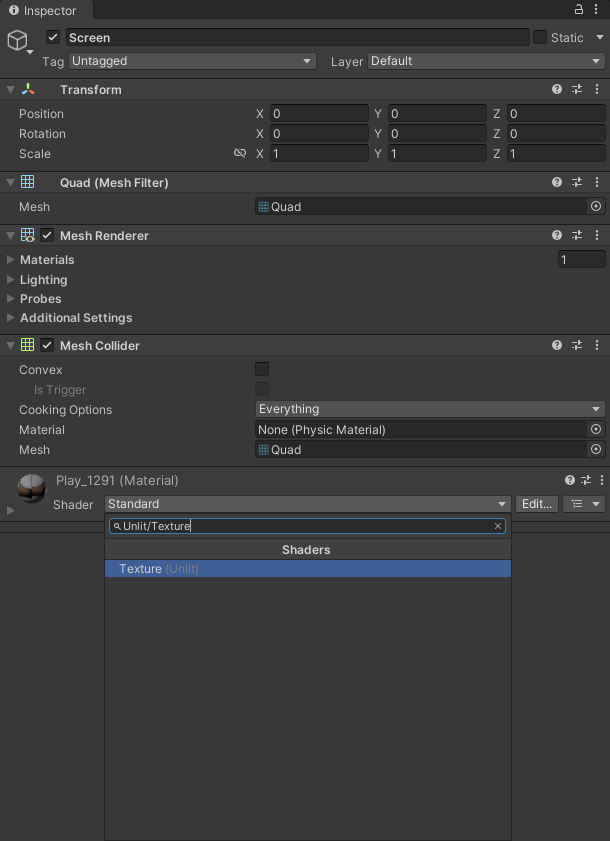


**Create Inference Manager object**

Right-click a space in the Hierarchy tab and select Create Empty. Name the empty object `InferenceManager`.


With the `InferenceManager` object selected, drag the `ImageClassifier` script into the Inspector tab.


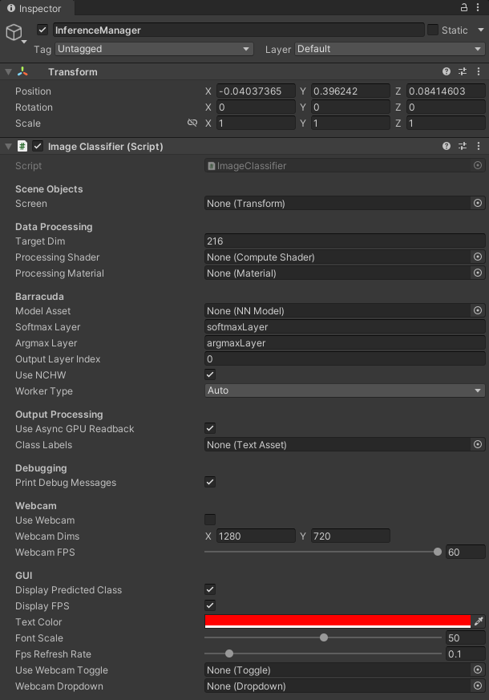


Now we can assign the Screen, compute shader, Material, ONNX file, and class labels file in the Inspector tab by dragging them into their respective fields.


**Add GUI prefab**

We still need to create the GUI toggle and dropdown menu. To save time, I made a [Prefab](https://docs.unity3d.com/Manual/Prefabs.html) that we can drop into the Scene. 

* **Google Drive:** [Canvas Prefab](https://drive.google.com/drive/folders/1ZP02X7vkhLzyouHjKNpD9bI6BU8YDjlM?usp=sharing)

Unity provides a free [UI Sample ](https://assetstore.unity.com/packages/essentials/ui-samples-25468)package for anyone that wants to try creating a custom UI, and there are plenty of [options](https://assetstore.unity.com/?category=tools%2Fgui\2d%2Fgui\3d%2Fgui&orderBy=1) on the Asset Store.


Drag and drop the Canvas prefab into a new folder called Prefabs. 

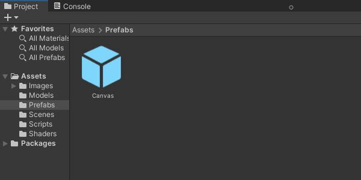


From there, drag the prefab into the Hierarchy tab. We can see the GUI by switching to the Game view.

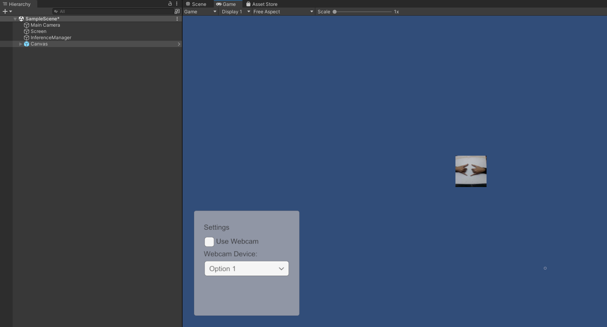


**Configure Webcam Toggle On Value Changed function**

Next, we need to pair the `WebcamToggle` with the `UpdateWebcamToggle` function in the `ImageClassifier` script. Expand the Canvas object and select the `WebcamToggle`.


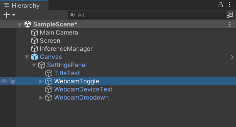


Click and drag the `InferenceManager` into the `On Value Changed` field.


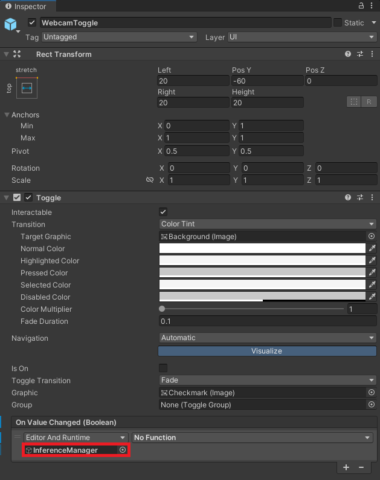


Open the `No Function` dropdown menu and select `ImageClassifier → UpdateWebcamToggle`.


**Configure Webcam Dropdown On Value Changed function**

We can follow the same steps to pair the `WebcamDropdown` with the `UpdateWebcamDevice` function in the `ImageClassifier` script.

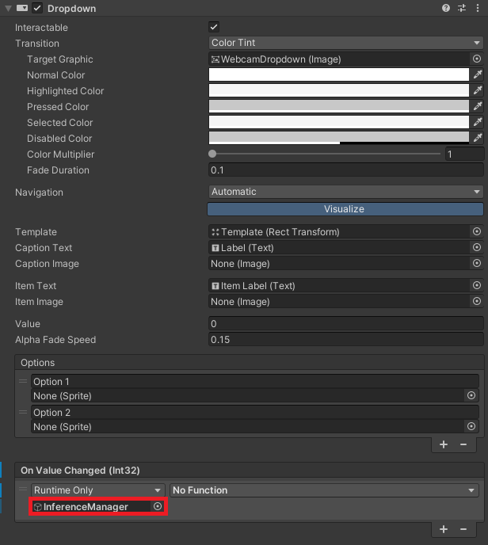


This time select `ImageClassifier → UpdateWebcamDevice`.


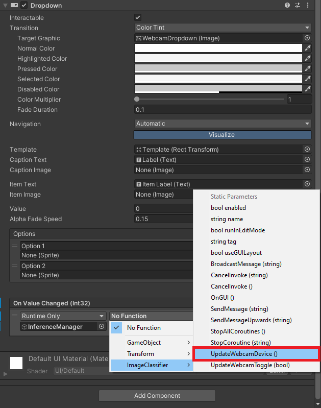


**Assign GUI objects to Inference Manager**

We can now assign the `WebcamToggle` and `WebcamDropdown` objects to their respective fields for the `ImageClassifier` script.


**Add Event System**

Before we can use the GUI, we need to add an Event System. Right-click a space in the Hierarchy tab and select `UI → Event System`.


## Test in Editor

We can finally test the project in the editor. Click the play button in the top-middle of the Editor window.


The predicted class should be `Play`, the dropdown menu should update with available webcam devices, and the Screen object should fill the preview window while maintaining the source aspect ratio. GPU utilization should hover near 100% when using asynchronous GPU readback.


## Summary

This post covered implementing an image classification model in a Unity project using the Barracuda library. Part 3 will cover building the Unity project to run in a web browser and hosting it using GitHub Pages.


**Previous:** [Fastai to Unity Tutorial Pt. 1](../part-1/)

**Next:** [Fastai to Unity Tutorial Pt. 3](../part-3/)

**Project Resources:** [GitHub Repository](https://github.com/cj-mills/fastai-to-unity-tutorial)


