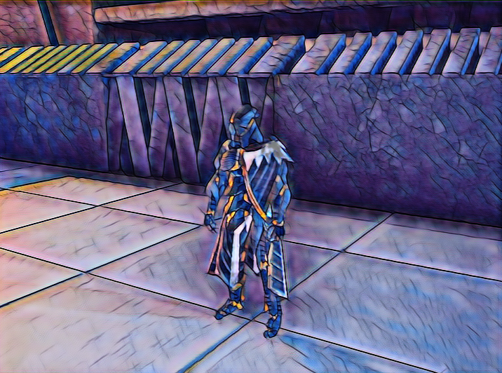

---
categories:
- unity
- log
date: 2021-1-9
description: Examining results from my initial attempts to optimize the few-shot video
  stylization model.
hide: false
layout: post
search_exclude: false
title: In-Game Style Transfer Experiments Pt.4
toc: false

---

* [Introduction](#introduction)
* [Shrinking the Model](#shrinking-the-model)
* [Results in Unity](#results-in-unity)
* [Training vs Unity](#training-vs-unity)
* [Conclusion](#conclusion)

## Introduction

I followed up on the [results](https://christianjmills.com/In-Game-Style-Transfer-Experiments-3/#using-a-smaller-model) in the last post by testing how much I could shrink the [video stylization model](https://christianjmills.com/In-Game-Style-Transfer-Experiments-1/#video-stylization-model). I was initially skeptical since that model is twice the size of the `fast_neural_style` model. However, the model was easy to modify using the config files provided in the [GitHub repository](https://github.com/OndrejTexler/Few-Shot-Patch-Based-Training). The hard part turned out to be getting the output in Unity to match the output during training.

## Shrinking the Model

I was able to shrink the model from 13MB to less than 1MB by modifying two lines in the config file. This involved significantly reducing the number and size of layers in the model.

Fortunately, this didn't seem to have any significant impact on the quality of the output. The model did however need to be trained longer to achieve similar results.

## Results in Unity

The modified video stylization model has better performance than the original `fast_neural_style` model, but is still far behind the [smaller variant](https://christianjmills.com/In-Game-Style-Transfer-Experiments-3/#resolution-720-x-540). On the plus side, flickering is still significantly reduced over the `fast_neural_style` model. 

### Resolution: 720 x 540

## Training vs Unity

Something that immediately stuck out was how differently this model stylizes the scene compared to the `fast_neural_style` model. This is surprising since the video stylization model was trained using output from the `fast neural_style` model. The model output during training was much closer to the `fast_neural_style` model as well.

At first, I thought the difference was because I didn't implement the preprocessing steps correctly. It was a bit of a pain figuring out what preprocessing operations I needed to apply from the source code. It seems to boil down to normalizing the RGB color values to the range `[-1,1]`. The output didn't seem to look right any other way, so I stuck with that.

I believe the difference is due to how this video stylization model is trained. It trains on only a handful of stylized images in a particular scene. It's possible that the model will require a much larger training set than normal to handle an entire video game level.

## Conclusion

I did not expect this model to perform as well as it did with so few layers. It's likely that the model can be further optimized with a more thoughtful approach. I'm going to conduct more training experiments to see how much I can make this model generalize. Hopefully, the smaller model can handle a wider variety of input.

