---
categories:
- onnx
- directml
- yolox
- object-detection
- unity
- tutorial
date: 8/18/2022
description: This tutorial covers creating an object detection plugin for a Unity
  game engine project using ONNX Runtime and DirectML. Part 1 covers creating a dynamic
  link library (DLL) file in Visual Studio to perform inference with the object detection
  model.
hide: false
image: ../social-media/cover.jpg
layout: post
search_exclude: false
title: Object Detection for Unity With ONNX Runtime and DirectML Pt. 1
toc: false

---

* [Introduction](#introduction)
* [Overview](#overview)
* [Download OpenCV](#download-opencv)
* [Create DLL Project](#create-dll-project)
* [Configure the Project](#configure-the-project)
* [Add Include Directories](#add-include-directories)
* [Link Libraries](#link-libraries)
* [Post Build Events](#post-build-events)
* [Install ONNX Runtime](#install-onnx-runtime)
* [Update Precompiled Header File](#update-precompiled-header-file)
* [Update dllmain File](#update-dllmain-file)
* [Build Solution](#build-solution)
* [Gather Dependencies](#gather-dependencies)
* [Summary](#summary)


## Introduction

A [previous tutorial series](https://christianjmills.com/IceVision-to-OpenVINO-to-Unity-Tutorial-1/) covered training an object detection model using [IceVision](https://airctic.com/0.12.0/) and creating an [OpenVINO](https://docs.openvino.ai/latest/index.html) plugin for the [Unity](https://unity.com/) game engine to perform inference with the trained model. OpenVINO can provide fast inference speeds but only targets Intel hardware. Not everyone has an Intel CPU, and discrete Intel GPUs are not yet widely available.

This follow-up tutorial covers building a plugin using [ONNX Runtime](https://onnxruntime.ai/docs/) and [DirectML](https://docs.microsoft.com/en-us/windows/ai/directml/dml) to enable inference on non-Intel CPUs and GPUs. ONNX Runtime is a cross-platform model accelerator that works with several hardware acceleration libraries. DirectML is a hardware-accelerated DirectX 12 library for machine learning on Windows.

We'll use the ONNX model [exported](https://christianjmills.com/IceVision-to-OpenVINO-to-Unity-Tutorial-1/#export-the-model) in the original tutorial, so no modifications to the training code are required.

- **Model Training Tutorial:** [End-to-End Object Detection for Unity With IceVision and OpenVINO Pt. 1](https://christianjmills.com/IceVision-to-OpenVINO-to-Unity-Tutorial-1/)


#### Unity Demo


## Overview

Part 1 covers creating a dynamic link library ([DLL](https://docs.microsoft.com/en-us/troubleshoot/windows-client/deployment/dynamic-link-library)) file in Visual Studio to perform inference with the object detection model.

> **Important:** This post assumes [Visual Studio](https://visualstudio.microsoft.com/downloads/) is present on your system.


## Download OpenCV

We'll use the [OpenCV](https://github.com/opencv/opencv) library to process image data from Unity. The tutorial uses OpenCV `4.6.0`, which is available at the link below.

* [OpenCV 4.6.0 GitHub](https://github.com/opencv/opencv/releases/tag/4.6.0)

Select the `opencv-4.6.0-vc14_vc15.exe` option from the Assets list.


Run the executable once it finishes downloading. You might get a warning from Windows that the executable is an unrecognized app. We can bypass this by clicking the `More info` text, then the Run anyway button.


Then, click the `Run anyway` button.


The executable will prompt us to select a location to extract the `opencv` folder. We'll need to give Visual Studio this location to access the library's functionality. I tend to place my C++ dependencies in a dedicated folder for consistency.


If we open the `opencv` folder, we can see a build folder and a source folder. Everything we need is in the build folder.


## Create DLL Project

Open Visual Studio and select the `Create a new project` option.


Type `DLL` into the text box and select the `Dynamic-Link Library (DLL)` option. This option automatically configures a few parameters for us compared to starting with a standard console application.


Choose a name and location for the project and click the `Create` button. By default, the DLL file will use the project name.


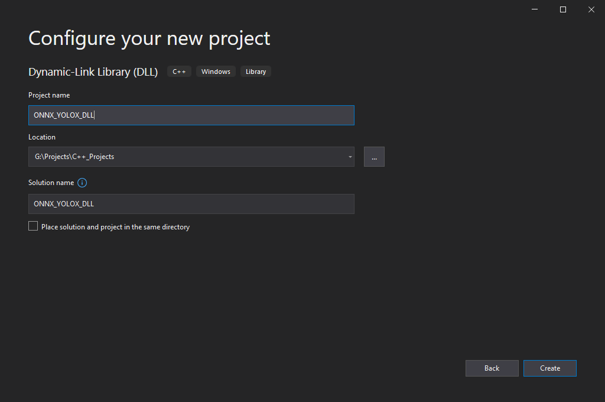


## Configure the Project

At the top of the window, open the Solution Configurations dropdown menu, and select `Release`.


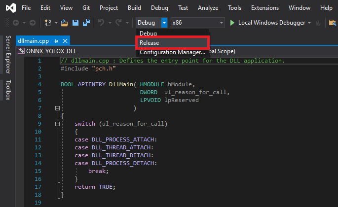


Then, open the Solution Platform dropdown menu and select `x64`.

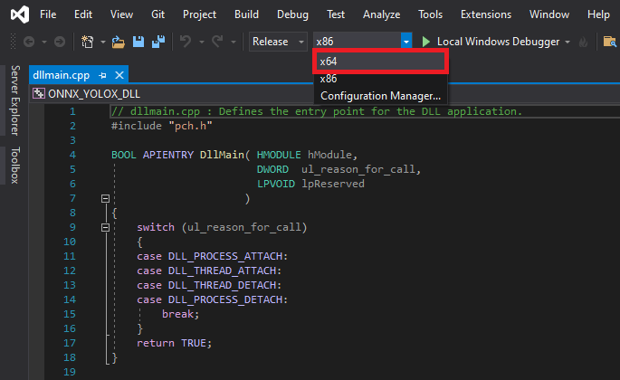


## Add Include Directories

We need to tell Visual Studio where OpenCV is so we can access its APIs. Right-click the project name in the Solution Explorer panel.

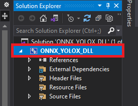


Select the `Properties` option in the popup menu.

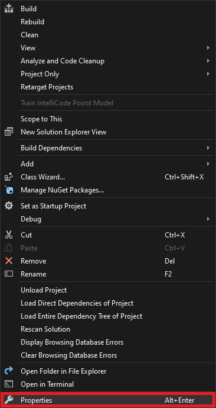


In the Properties Window, open on the `C/C++` dropdown. Select the `Additional Include Directories` section and click on `<Edit..>` in the dropdown.

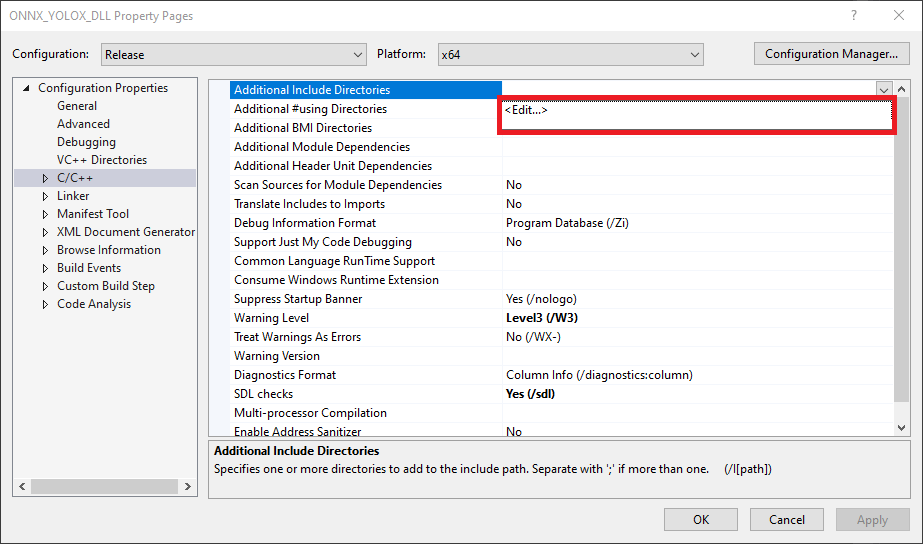


Add the path for the following folder, replacing `<parent-folder-path>` with the full path to the parent folder for the OpenCV library, and click `OK`.

* `<parent-folder-path>\opencv\build\include`


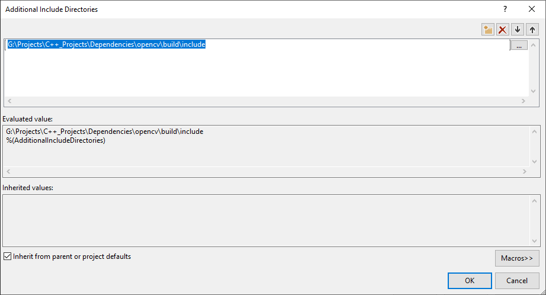


## Link Libraries

Next, open the `Linker` dropdown in the Properties window and select `Input`. Select `Additional Dependencies` and click `<Edit..>`.


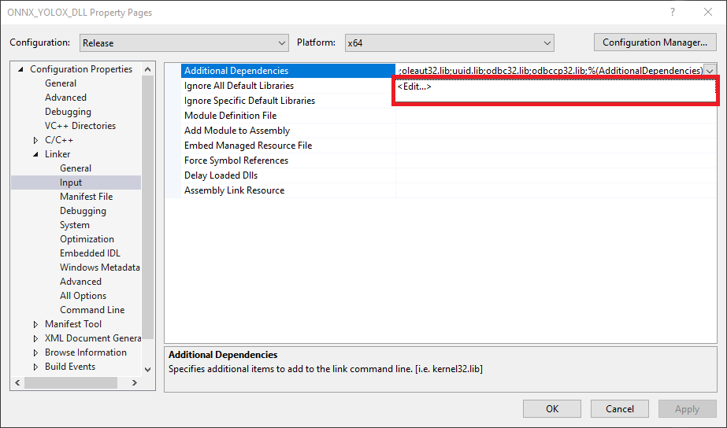


Add the following path, replacing `<parent-folder-path>` with the full path to the parent folder for the OpenCV library, and click `OK`.

* `<parent-folder-path>\opencv\build\x64\vc15\lib\*`


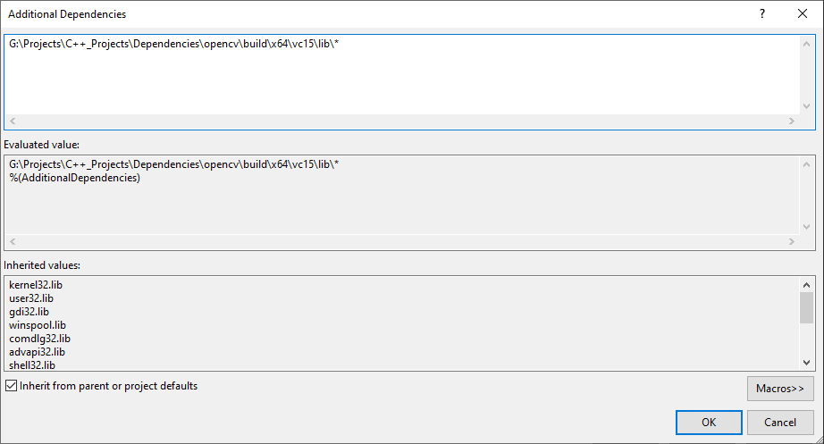


## Post Build Events

Our DLL file will depend on the following DLL file included with OpenCV.

**OpenCV DLL files**


We can add a post-build event in Visual Studio to automatically copy these DLL files to the build folder for the project at compile time. Open the `Build Events` dropdown in the Properties window and select `Post-Build Event`. Select `Command Line` and click `<Edit..>`.


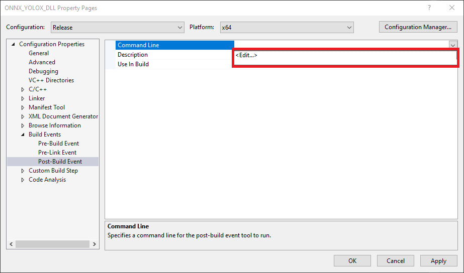


Add the following commands, replacing `<parent-folder-path>` with the full path to the parent folder for the OpenCV library, and click `OK`.

* `xcopy <parent-folder-path>\opencv\build\x64\vc15\bin\opencv_world452.dll $(SolutionDir)$(Platform)\$(Configuration)\ /c /y`


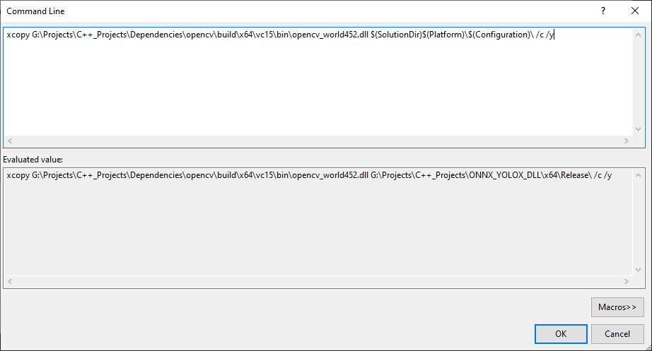


Finally, click the `Apply` button and close the Properties window.

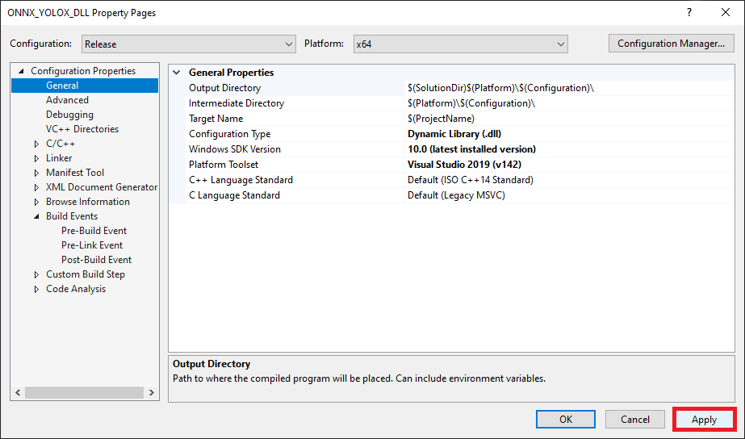


## Install ONNX Runtime

We can install ONNX Runtime with DirectML directly into our project via the [NuGet](https://www.nuget.org/) package manager integrated with Visual Studio. Open the `Project` menu and select `Manage NuGet Packages...` from the dropdown menu.


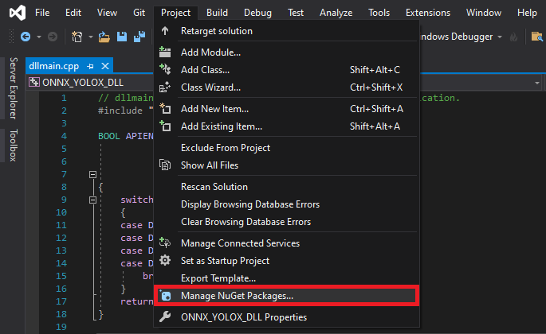


Select the `Browse` option and enter `Microsoft.ML.OnnxRuntime.DirectML` into the search box.

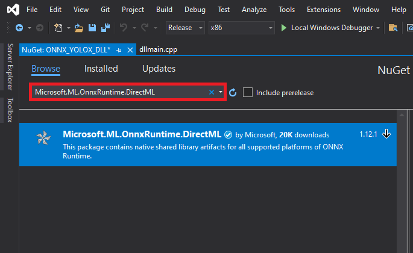


With the package selected, click the `Install` button. The project uses version `1.12.1`.

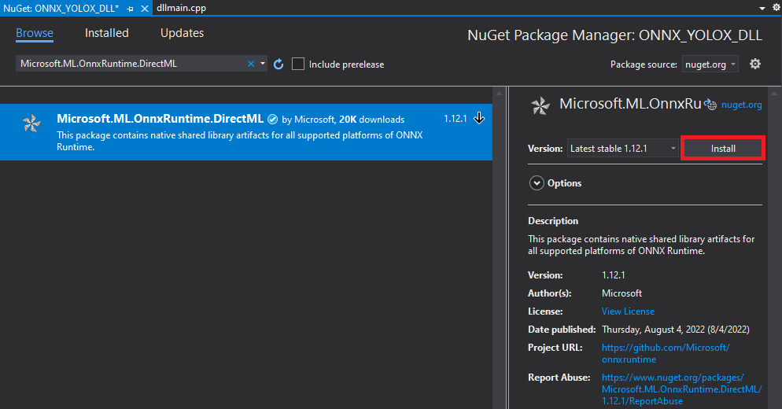


Click `OK` in the popup window.

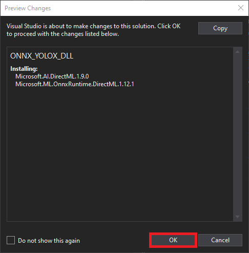


With the dependencies taken care of, we can start modifying the code.


## Update Precompiled Header File

We'll first update the `pch.h` [Precompiled Header file](https://docs.microsoft.com/en-us/cpp/build/creating-precompiled-header-files?view=msvc-160) with the required header files. We can open the `pch.h` file by selecting it in the Solution Explorer window.

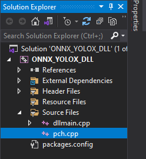


Comment or remove the `#include` line for the `framework.h` header file.

```c++
// pch.h: This is a precompiled header file.
// Files listed below are compiled only once, improving build performance for future builds.
// This also affects IntelliSense performance, including code completion and many code browsing features.
// However, files listed here are ALL re-compiled if any one of them is updated between builds.
// Do not add files here that you will be updating frequently as this negates the performance advantage.

#ifndef PCH_H
#define PCH_H

// add headers that you want to pre-compile here
//#include "framework.h"

#endif //PCH_H

```


**Add required header files**

Next, we'll add the required header files for ONNX Runtime and OpenCV below `//#include "framework.h"` line.

```c++
// pch.h: This is a precompiled header file.
// Files listed below are compiled only once, improving build performance for future builds.
// This also affects IntelliSense performance, including code completion and many code browsing features.
// However, files listed here are ALL re-compiled if any one of them is updated between builds.
// Do not add files here that you will be updating frequently as this negates the performance advantage.

#ifndef PCH_H
#define PCH_H

// add headers that you want to pre-compile here
//#include "framework.h"
#include <onnxruntime_cxx_api.h>
#include "dml_provider_factory.h"
#include <opencv2/opencv.hpp>

#endif //PCH_H

```


## Update dllmain File

By default, the `dllmain.cpp` file contains the following code. 

```c++
// dllmain.cpp : Defines the entry point for the DLL application.
#include "pch.h"

BOOL APIENTRY DllMain( HMODULE hModule,
                       DWORD  ul_reason_for_call,
                       LPVOID lpReserved
                     )
{
    switch (ul_reason_for_call)
    {
    case DLL_PROCESS_ATTACH:
    case DLL_THREAD_ATTACH:
    case DLL_THREAD_DETACH:
    case DLL_PROCESS_DETACH:
        break;
    }
    return TRUE;
}
```

We can delete everything below the `#include "pch.h"` line.


**Create a macro to mark functions we want to make accessible in Unity**

```c++
// dllmain.cpp : Defines the entry point for the DLL application.
#include "pch.h"


// Create a macro to quickly mark a function for export
#define DLLExport __declspec (dllexport)
```


**Wrap the code in extern "C" to prevent name-mangling issues with the compiler**

The rest of our code will go inside here.

```c++
// Wrap code to prevent name-mangling issues
extern "C" {

}
```


**Define variables**

Inside the wrapper, we will declare the persistent variables needed for the DLL.

* [OrtApi](https://onnxruntime.ai/docs/api/c/struct_ort_api.html): ONNX Runtime API interface
* [OrtEnv](https://onnxruntime.ai/docs/api/c/struct_ort_1_1_env.html): Holds the logging state for the ONNX Runtime objects
* [OrtSessionOptions](https://onnxruntime.ai/docs/api/c/struct_ort_1_1_session_options.html): Holds the options used when creating a new ONNX Runtime session
* [OrtSession](https://onnxruntime.ai/docs/api/c/struct_ort_1_1_session.html): The ONNX Runtime session

----

```c++
// The current source image width
int img_w;
// The current source image height
int img_h;
// The current model input width
int input_w;
// The current model input height
int input_h;
// The total number pixels in the input image
int n_pixels;
// The number of color channels 
int n_channels = 3;

// Stores information about a single object prediction
struct Object
{
    float x0;
    float y0;
    float width;
    float height;
    int label;
    float prob;
};

// Store grid offset and stride values to decode a section of the model output
struct GridAndStride
{
    int grid0;
    int grid1;
    int stride;
};

// The scale values used to adjust the model output to the source image resolution
float scale_x;
float scale_y;

// The minimum confidence score to consider an object proposal
float bbox_conf_thresh = 0.3;
// The maximum intersection over union value before an object proposal will be ignored
float nms_thresh = 0.45;

// Stores the grid and stride values to navigate the raw model output
std::vector<GridAndStride> grid_strides;
// Stores the object proposals with confidence scores above bbox_conf_thresh
std::vector<Object> proposals;
// Stores the indices for the object proposals selected using non-maximum suppression
std::vector<int> proposal_indices;

// The stride values used to generate the gride_strides vector
std::vector<int> strides = { 8, 16, 32 };

// The mean of the ImageNet dataset used to train the model
const float mean[] = { 0.485f, 0.456f, 0.406f };
// The standard deviation of the ImageNet dataset used to train the model
const float std_dev[] = { 0.229f, 0.224f, 0.225f };

// ONNX Runtime API interface
const OrtApi* ort = NULL;

// List of available execution providers
char** provider_names;
int provider_count;

// Holds the logging state for the ONNX Runtime objects
OrtEnv* env;
// Holds the options used when creating a new ONNX Runtime session
OrtSessionOptions* session_options;
// The ONNX Runtime session
OrtSession* session;

// The name of the model input
char* input_name;
// The name of the model output
char* output_name;

// A pointer to the raw input data
float* input_data;
// The memory size of the raw input data
int input_size;
```


**Define a function to convert `char` data to `wchar_t`**

ONNX Runtime expects  paths to ONNX model files to be in `wchar_t` format. We receive the file paths in `char` format, so we'll make a function to convert them.

```c++
/// <summary>
/// Convert char data to wchar_t
/// </summary>
/// <param name="text"></param>
/// <returns></returns>
static wchar_t* charToWChar(const char* text)
{
    const size_t size = strlen(text) + 1;
    wchar_t* wText = new wchar_t[size];
    size_t converted_chars;
    mbstowcs_s(&converted_chars, wText, size, text, _TRUNCATE);
    return wText;
}
```


**Define a function to initialize the interface to the ONNX Runtime API**


* [OrtGetApiBase](https://onnxruntime.ai/docs/api/c/group___global.html#gaff6ff297798b9337d4c0f89a35b76aa6): The Onnxruntime library's entry point to access the C API. 

* [GetAvailableProviders](https://onnxruntime.ai/docs/api/c/struct_ort_api.html#aaacd4a9540eb5044291addd2ebd9bc5f): Get the names of all available providers.

------

```c++
/// <summary>
/// Initialize the ONNX Runtime API interface and get the available execution providers
/// </summary>
/// <returns></returns>
DLLExport void InitOrtAPI() {

    ort = OrtGetApiBase()->GetApi(ORT_API_VERSION);

    ort->GetAvailableProviders(&provider_names, &provider_count);
}
```


**Define a function to get the number of execution providers**

The next function we'll define will create a list of available execution providers and return the number of providers accessible by ONNX Runtime. We'll use this information to select which device to use to perform inference from the Unity application.


```c++
/// <summary>
/// Get the number of available execution providers
/// </summary>
/// <returns>The number of available devices</returns>
DLLExport int GetProviderCount()
{
    // Return the number of available execution providers
    return provider_count;
}
```


**Define a function to get the name of an execution provider**

Next, we'll define a function to return the name at a specified index in the list of available execution providers.

```c++
/// <summary>
/// Get the name of the execution provider at the specified index
/// </summary>
/// <param name="index"></param>
/// <returns>The name of the execution provider at the specified index</returns>
DLLExport char* GetProviderName(int index) {
    return provider_names[index];
}
```


**Define method to generate stride values to navigate the raw model output**

The method for generating the offset values used to traverse the output array is almost identical to the Python implementation from the [training tutorial](https://christianjmills.com/IceVision-to-OpenVINO-to-Unity-Tutorial-1/#define-post-processing-steps).

```c++
/// <summary>
/// Generate offset values to navigate the raw model output
/// </summary>
/// <param name="height">The model input height</param>
/// <param name="width">The model input width</param>
void GenerateGridsAndStride(int height, int width)
{
    // Remove the values for the previous input resolution
    grid_strides.clear();

    // Iterate through each stride value
    for (auto stride : strides)
    {
        // Calculate the grid dimensions
        int grid_height = height / stride;
        int grid_width = width / stride;

        // Store each combination of grid coordinates
        for (int g1 = 0; g1 < grid_height; g1++)
        {
            for (int g0 = 0; g0 < grid_width; g0++)
            {
                grid_strides.push_back(GridAndStride{ g0, g1, stride });
            }
        }
    }
}
```


**Define a function to set the minimum confidence score from Unity**

We might want to try different confidence thresholds for keeping object proposals from the Unity application, so we'll add a function to enable this.

```c++
/// <summary>
/// Set minimum confidence score for keeping bounding box proposals
/// </summary>
/// <param name="min_confidence">The minimum confidence score for keeping bounding box proposals</param>
DLLExport void SetConfidenceThreshold(float min_confidence)
{
    bbox_conf_thresh = min_confidence;
}
```


**Define function to refresh memory when switching models or execution providers**

* [ReleaseSession](https://onnxruntime.ai/docs/api/c/struct_ort_api.html#ae311be14b0e35ce3ad3bc1418a79d7bb)
* [ReleaseEnv](https://onnxruntime.ai/docs/api/c/struct_ort_api.html#a5edc51815e9aeba83516e4fe55ef836a)

------

```c++
/// <summary>
/// Refresh memory when switching models or execution providers
/// </summary>
DLLExport void RefreshMemory() {
    if (input_data) free(input_data);
    if (session) ort->ReleaseSession(session);
    if (env) ort->ReleaseEnv(env);
}
```


**Define a function to load an ONNX model**


* [CreateEnv](https://onnxruntime.ai/docs/api/c/struct_ort_api.html#a22085f699a2d1adb52f809383f475ed1): Create an OrtEnv.
* [DisableTelemetryEvents](https://onnxruntime.ai/docs/api/c/struct_ort_api.html#a74a22efe6571fe538e60f677654ae01f): Disable telemetry.
* [CreateSessionOptions](https://onnxruntime.ai/docs/api/c/struct_ort_api.html#a033b8a4a9de072bcc9dda3a8434922c5): Create an [OrtSessionOptions](https://onnxruntime.ai/docs/api/c/group___global.html#gaa6c56bcb36e39611481a17065d3ce620) object. 
* [DisableMemPattern](https://onnxruntime.ai/docs/api/c/struct_ort_api.html#ab090eb2a54f5dfaf0377a8cc72d65c5f): Disable the memory pattern optimization.
* [SetSessionExecutionMode](https://onnxruntime.ai/docs/api/c/struct_ort_api.html#a8113f817428f87ef4926d97809291155): Controls whether you want to execute operators in your graph sequentially or in parallel.
* OrtSessionOptionsAppendExecutionProvider_DML: Add a DirectML execution provider.
* [CreateSession](https://onnxruntime.ai/docs/api/c/struct_ort_api.html#a8e8529eb336bbe2334307c9197891838): Create an OrtSession from a model file. 
* [ReleaseSessionOptions](https://onnxruntime.ai/docs/api/c/struct_ort_api.html#a2fa11d21f36cbd068a82682ea175d774): Free an [OrtSessionOptions](https://onnxruntime.ai/docs/api/c/group___global.html#gaa6c56bcb36e39611481a17065d3ce620) object.
* [AllocatorWithDefaultOptions](https://onnxruntime.ai/docs/api/c/struct_ort_1_1_allocator_with_default_options.html): Create the default allocator.
* [SessionGetInputName](https://onnxruntime.ai/docs/api/c/struct_ort_api.html#a811b1773c7d713750716a36b432e2102): Get input name.
* [SessionGetOutputName](https://onnxruntime.ai/docs/api/c/struct_ort_api.html#a130f69dae071631abd50cae5a26d5d9d): Get output name.

------

```c++
/// <summary>
/// Load a model from the specified file path
/// </summary>
/// <param name="model_path">The full model path to the ONNX model</param>
/// <param name="execution_provider">The name for the desired execution_provider</param>
/// <param name="image_dims">The source image dimensions</param>
/// <returns>A status value indicating success or failure to load and reshape the model</returns>
DLLExport int LoadModel(char* model_path, char* execution_provider, int image_dims[2])
{
    int return_val = 0;

    // Initialize the ONNX runtime environment
    std::string instance_name = "yolox-inference";
    ort->CreateEnv(ORT_LOGGING_LEVEL_WARNING, instance_name.c_str(), &env);

    // Disable telemetry
    ort->DisableTelemetryEvents(env);

    // Add the selected execution provider
    ort->CreateSessionOptions(&session_options);
    std::string provider_name = execution_provider;
	
    // Add the specified execution provider
    if (provider_name.find("CPU") != std::string::npos) {
        return_val = 1;
    }
    else if (provider_name.find("Dml") != std::string::npos) {
        ort->DisableMemPattern(session_options);
        ort->SetSessionExecutionMode(session_options, ExecutionMode::ORT_SEQUENTIAL);
        OrtSessionOptionsAppendExecutionProvider_DML(session_options, 0);
    }
    else return_val = 1;

    // Create a new inference session
    ort->CreateSession(env, charToWChar(model_path), session_options, &session);
    ort->ReleaseSessionOptions(session_options);

    Ort::AllocatorWithDefaultOptions allocator;

    // Get input and output names
    ort->SessionGetInputName(session, 0, allocator, &input_name);
    ort->SessionGetOutputName(session, 0, allocator, &output_name);

    // The dimensions of the source input image
    img_w = image_dims[0];
    img_h = image_dims[1];
    // Calculate new input dimensions based on the max stride value
    input_w = (int)(strides.back() * std::roundf(img_w / strides.back()));
    input_h = (int)(strides.back() * std::roundf(img_h / strides.back()));
    n_pixels = input_w * input_h;

    // Calculate the value used to adjust the model output to the source image resolution
    scale_x = input_w / (img_w * 1.0);
    scale_y = input_h / (img_h * 1.0);

    // Generate the grid and stride values based on input resolution
    GenerateGridsAndStride(input_h, input_w);

    // Replace the initial input dims with the updated values
    image_dims[0] = input_w;
    image_dims[1] = input_h;

    // Allocate memory for the raw input data
    input_size = n_pixels * n_channels * (int)sizeof(float);
    input_data = (float*)malloc((size_t)input_size * sizeof(float*));
    if (input_data != NULL) memset(input_data, 0, input_size);

    // Return a value of 0 if the model loads successfully
    return return_val;
}
```


**Define method to generate object detection proposals from the raw model output**

The method to generate object proposals is nearly identical to the Python implementation from the training tutorial.

```c++
/// <summary>
/// Generate object detection proposals from the raw model output
/// </summary>
/// <param name="out_ptr">A pointer to the output tensor data</param>
void GenerateYoloxProposals(float* out_ptr, int proposal_length)
{
    // Remove the proposals for the previous model output
    proposals.clear();

    // Obtain the number of classes the model was trained to detect
    int num_classes = proposal_length - 5;

    for (int anchor_idx = 0; anchor_idx < grid_strides.size(); anchor_idx++)
    {
        // Get the current grid and stride values
        int grid0 = grid_strides[anchor_idx].grid0;
        int grid1 = grid_strides[anchor_idx].grid1;
        int stride = grid_strides[anchor_idx].stride;

        // Get the starting index for the current proposal
        int start_idx = anchor_idx * proposal_length;

        // Get the coordinates for the center of the predicted bounding box
        float x_center = (out_ptr[start_idx + 0] + grid0) * stride;
        float y_center = (out_ptr[start_idx + 1] + grid1) * stride;

        // Get the dimensions for the predicted bounding box
        float w = exp(out_ptr[start_idx + 2]) * stride;
        float h = exp(out_ptr[start_idx + 3]) * stride;

        // Calculate the coordinates for the upper left corner of the bounding box
        float x0 = x_center - w * 0.5f;
        float y0 = y_center - h * 0.5f;

        // Get the confidence score that an object is present
        float box_objectness = out_ptr[start_idx + 4];

        // Initialize object struct with bounding box information
        Object obj = { x0, y0, w, h, 0, 0 };

        // Find the object class with the highest confidence score
        for (int class_idx = 0; class_idx < num_classes; class_idx++)
        {
            // Get the confidence score for the current object class
            float box_cls_score = out_ptr[start_idx + 5 + class_idx];
            // Calculate the final confidence score for the object proposal
            float box_prob = box_objectness * box_cls_score;

            // Check for the highest confidence score
            if (box_prob > obj.prob)
            {
                obj.label = class_idx;
                obj.prob = box_prob;
            }
        }

        // Only add object proposals with high enough confidence scores
        if (obj.prob > bbox_conf_thresh) proposals.push_back(obj);
    }

    // Sort the proposals based on the confidence score in descending order
    std::sort(proposals.begin(), proposals.end(), [](Object& a, Object& b) -> bool
              { return a.prob > b.prob; });
}
```


**Define function to sort bounding box proposals using Non-Maximum Suppression**

The C++ API for OpenCV has built-in functionality to perform comparison operations between rectangles. Therefore, we don't need to define helper functions to calculate the intersection and union areas of two bounding boxes. Otherwise, the method to sort bounding box proposals using Non-Maximum Suppression is almost identical to the Python implementation from part 1.

```c++
/// <summary>
/// Filter through a sorted list of object proposals using Non-maximum suppression
/// </summary>
void NmsSortedBboxes()
{
    // Remove the picked proposals for the previous model outptut
    proposal_indices.clear();

    // Iterate through the object proposals
    for (int i = 0; i < proposals.size(); i++)
    {
        Object& a = proposals[i];

        // Create OpenCV rectangle for the Object bounding box
        cv::Rect_<float> rect_a = cv::Rect_<float>(a.x0, a.y0, a.width, a.height);

        bool keep = true;

        // Check if the current object proposal overlaps any selected objects too much
        for (int j : proposal_indices)
        {
            Object& b = proposals[j];

            // Create OpenCV rectangle for the Object bounding box
            cv::Rect_<float> rect_b = cv::Rect_<float>(b.x0, b.y0, b.width, b.height);

            // Calculate the area where the two object bounding boxes overlap
            float inter_area = (rect_a & rect_b).area();
            // Calculate the union area of both bounding boxes
            float union_area = rect_a.area() + rect_b.area() - inter_area;
            // Ignore object proposals that overlap selected objects too much
            if (inter_area / union_area > nms_thresh)
                keep = false;
        }

        // Keep object proposals that do not overlap selected objects too much
        if (keep) proposal_indices.push_back(i);
    }
}
```


**Define a function to perform inference**

We will access the pixel data for the input image from Unity with a pointer to a [uchar](https://docs.opencv.org/4.5.1/d1/d1b/group__core__hal__interface.html#ga65f85814a8290f9797005d3b28e7e5fc) (unsigned 1-byte integer) array and wrap the data in a [cv::Mat](https://docs.opencv.org/master/d3/d63/classcv_1_1Mat.html) variable for processing. 

After processing the model output, we'll return the final number of detected objects to Unity so we can initialize an array of objects.

* [cv::Mat](https://docs.opencv.org/3.4/d3/d63/classcv_1_1Mat.html): n-dimensional dense array class  
* [cv::cvtColor()](https://docs.opencv.org/3.4/d8/d01/group__imgproc__color__conversions.html#ga397ae87e1288a81d2363b61574eb8cab): Converts an image from one color space to another
* [OrtMemoryInfo](https://onnxruntime.ai/docs/api/c/struct_ort_1_1_memory_info.html):
* [CreateCpuMemoryInfo](https://onnxruntime.ai/docs/api/c/struct_ort_api.html#a6a64ee931925577fd40f5f3f7472cfed): Create an [OrtMemoryInfo](https://onnxruntime.ai/docs/api/c/group___global.html#ga088f45e429651ac29b4a9efb4d88571a) for CPU memory.
* [OrtValue](https://onnxruntime.ai/docs/api/c/struct_ort_1_1_value.html)
* [CreateTensorWithDataAsOrtValue](https://onnxruntime.ai/docs/api/c/struct_ort_api.html#a2aad3ccd68c66d0b38bdb966467d9324): Create a tensor backed by a user supplied buffer. 
* [ReleaseMemoryInfo](https://onnxruntime.ai/docs/api/c/struct_ort_api.html#a62f73350760cf7cc483216ac44222d0b)
* [Run](https://onnxruntime.ai/docs/api/c/struct_ort_api.html#ad8b12cad4160d43da92f49191cd91895): Run the model in an [OrtSession](https://onnxruntime.ai/docs/api/c/group___global.html#ga5220ca3b3f0a31a01a3f15057c35cac6). 
* [OrtTensorTypeAndShapeInfo](https://onnxruntime.ai/docs/api/c/struct_ort_1_1_tensor_type_and_shape_info.html)
* [GetTensorTypeAndShape](https://onnxruntime.ai/docs/api/c/struct_ort_api.html#a97f8d1f1dbcd39214f50f1dc9e8aef7b): Get type and shape information from a tensor [OrtValue](https://onnxruntime.ai/docs/api/c/group___global.html#gaab167acf3fe9dabc0195b993fbe7ee7d). 
* [GetDimensionsCount](https://onnxruntime.ai/docs/api/c/struct_ort_api.html#a4b4e5b170de480987d23d350ccc55349): Get dimension count in [OrtTensorTypeAndShapeInfo](https://onnxruntime.ai/docs/api/c/group___global.html#ga6af32c548904330b6bd7e8cba6e186c1). 
* [GetDimensions](https://onnxruntime.ai/docs/api/c/struct_ort_api.html#ae06620ce959abdb68f982a200fb003cd): Get dimensions in [OrtTensorTypeAndShapeInfo](https://onnxruntime.ai/docs/api/c/group___global.html#ga6af32c548904330b6bd7e8cba6e186c1).
* [GetTensorMutableData](https://onnxruntime.ai/docs/api/c/struct_ort_api.html#a24486475cc05b9228a57b814b2024d77): Get a pointer to the raw data inside a tensor.

------

```c++
/// <summary>
/// Perform inference with the provided texture data
/// </summary>
/// <param name="image_data">The source image data from Unity</param>
/// <returns>The final number of detected objects</returns>
DLLExport int PerformInference(uchar* image_data)
{
    // Store the pixel data for the source input image in an OpenCV Mat
    cv::Mat input_image = cv::Mat(img_h, img_w, CV_8UC4, image_data);
    // Remove the alpha channel
    cv::cvtColor(input_image, input_image, cv::COLOR_RGBA2RGB);
    // Resize the image to the model input dimensions
    cv::resize(input_image, input_image, cv::Size(input_w, input_h));

    // Iterate over each pixel in image
    for (int p = 0; p < n_pixels; p++)
    {
        for (int ch = 0; ch < n_channels; ch++) {
            // Scale and normalize each value
            input_data[ch * n_pixels + p] = ((input_image.data[p * n_channels + ch] / 255.0f) - mean[ch]) / std_dev[ch];
        }
    }

    // Initialize list of input and output names
    const char* input_names[] = { input_name };
    const char* output_names[] = { output_name };
    // Initialize the list of model input dimension
    int64_t input_shape[] = { 1, 3, input_h, input_w };
    int input_shape_len = sizeof(input_shape) / sizeof(input_shape[0]);

    // Initialize an input tensor object with the input_data
    OrtMemoryInfo* memory_info;
    ort->CreateCpuMemoryInfo(OrtArenaAllocator, OrtMemTypeDefault, &memory_info);

    OrtValue* input_tensor = NULL;
    ort->CreateTensorWithDataAsOrtValue(memory_info, input_data, input_size, input_shape,
                                        input_shape_len, ONNX_TENSOR_ELEMENT_DATA_TYPE_FLOAT,
                                        &input_tensor);

    ort->ReleaseMemoryInfo(memory_info);


    OrtValue* output_tensor = NULL;
    // Perform inference
    ort->Run(session, NULL, input_names, (const OrtValue* const*)&input_tensor, 1, output_names, 1,
             &output_tensor);

    // Make sure the output tensor is not NULL to avoid potential crashes
    if (output_tensor == NULL) {
        ort->ReleaseValue(input_tensor);
        ort->ReleaseValue(output_tensor);
        return -1;
    }

    // Get the length of a single object proposal (i.e., number of object classes + 5)
    OrtTensorTypeAndShapeInfo* output_tensor_info;
    ort->GetTensorTypeAndShape(output_tensor, &output_tensor_info);
    size_t output_length[1] = {};
    ort->GetDimensionsCount(output_tensor_info, output_length);
    int64_t output_dims[3] = {};
    ort->GetDimensions(output_tensor_info, output_dims, *output_length);

    // Access model output
    float* out_data;
    ort->GetTensorMutableData(output_tensor, (void**)&out_data);

    // Generate new proposals for the current model output
    GenerateYoloxProposals(out_data, output_dims[2]);

    // Pick detected objects to keep using Non-maximum Suppression
    NmsSortedBboxes();

    // Free memory for input and output tensors
    ort->ReleaseValue(input_tensor);
    ort->ReleaseValue(output_tensor);

    // return the final number of detected objects
    return (int)proposal_indices.size();
}
```


**Define a function to populate an array of objects from Unity**

Next, we'll define a function to populate an array of objects from Unity. We call this function after initializing the list based on the current number of detected objects. We'll also scale the bounding box information from the input dimensions to the source image resolution.

```c++
/// <summary>
/// Fill the provided array with the detected objects
/// </summary>
/// <param name="objects">A pointer to a list of objects from Unity</param>
DLLExport void PopulateObjectsArray(Object* objects) 
{

    for (int i = 0; i < proposal_indices.size(); i++)
    {
        Object obj = proposals[proposal_indices[i]];

        // Adjust offset to source image resolution and clamp the bounding box
        objects[i].x0 = std::min(obj.x0 / scale_x, (float)img_w);
        objects[i].y0 = std::min(obj.y0 / scale_y, (float)img_h);
        objects[i].width = std::min(obj.width / scale_x, (float)img_w);
        objects[i].height = std::min(obj.height / scale_y, (float)img_h);

        objects[i].label = obj.label;
        objects[i].prob = obj.prob;
    }
}
```


**Define a function to clear memory when the Unity application exits**

This last function will free the memory allocated by the plugin. We'll call it when the Unity application shuts down.

```c++
/// <summary>
/// Free memory
/// </summary>
DLLExport void FreeResources()
{
    grid_strides.clear();
    proposals.clear();
    proposal_indices.clear();

    free(input_data);
    ort->ReleaseSession(session);
    ort->ReleaseEnv(env);
}
```


That is all the code needed for the plugin. We can now build the solution to generate the DLL file.


## Build Solution

Open the Build menu at the top of the Visual Studio window and click `Build Solution`. Visual Studio will generate a new x64 folder in the project directory containing the DLL file and its dependencies.


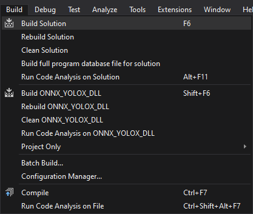


## Gather Dependencies

Right-click the project name in the Solution Explorer panel and select `Open Folder in File Explorer` from the popup menu.


In the new File Explorer window, go to the parent folder.

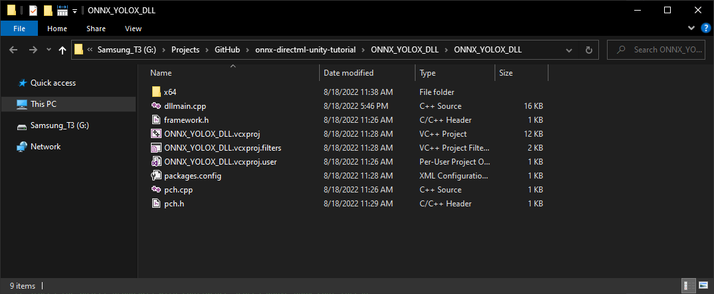


Open the `x64 → Release` subfolder.


We'll need to copy all the DLL files in this folder to the Unity project.

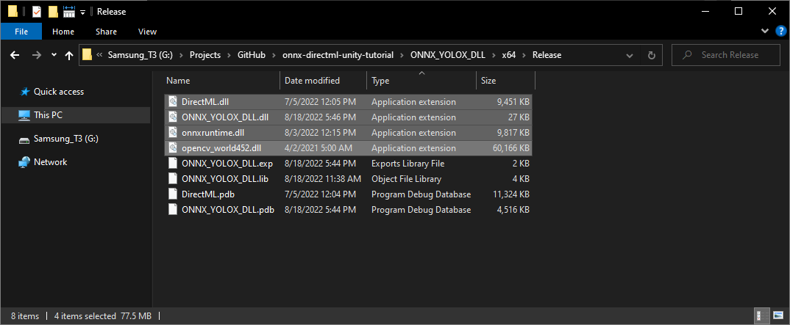


## Summary

This post covered creating a dynamic link library ([DLL](https://docs.microsoft.com/en-us/troubleshoot/windows-client/deployment/dynamic-link-library)) file to perform inference with a YOLOX model using [ONNX Runtime](https://onnxruntime.ai/docs/) and [DirectML](https://docs.microsoft.com/en-us/windows/ai/directml/dml). In part 2, we'll build a project in [Unity](https://unity.com/) that uses this DLL.


**Training Tutorial:** [End-to-End Object Detection for Unity With IceVision and OpenVINO Pt. 1](https://christianjmills.com/IceVision-to-OpenVINO-to-Unity-Tutorial-1/)

**Next:** [Object Detection for Unity With ONNX Runtime and DirectML Pt. 2](https://christianjmills.com/ONNX-DiretML-to-Unity-Tutorial-2/)

**Project Resources:** [GitHub Repository](https://github.com/cj-mills/onnx-directml-unity-tutorial)


